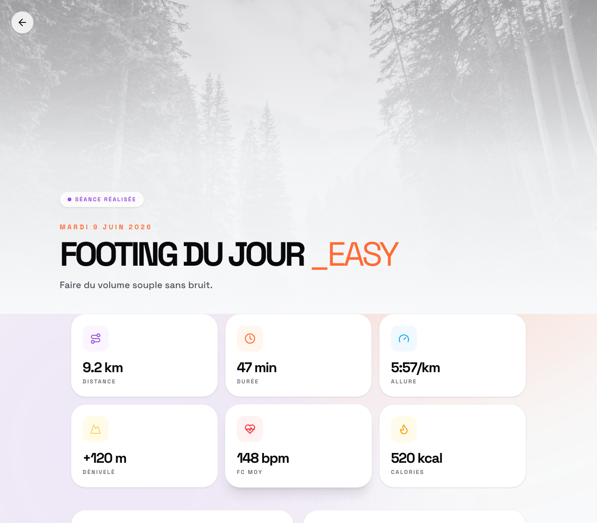

# FitMAS

**An autonomous coaching system for real-life consistency — starting as the smallest reliable running coach I can trust every day.**

[](https://github.com/LoicLang/fitMAS/actions/workflows/ci.yml)
[](LICENSE)
[](https://www.python.org/)

> **The thesis:** the LLM understands and generates; a deterministic verifier holds authority. Reliability comes from the checker — not from caging the model.

---

## Vision

FitMAS is not a fitness app, and the hard problem was never *generating a training plan* — any model can write you a plan. The hard problem is **consistency in real life**: staying on track when a calf niggles, a work trip lands, a week falls apart, motivation dips. Generic trackers ignore all of that and plow ahead with the idealized plan.

The long-term ambition is an **autonomous coaching staff** — not one chatbot, but a set of cooperating agents: a coach that plans, a recovery reviewer that reads your fatigue, an accountability agent that keeps you honest, a memory that carries your history, and an arbiter that resolves them into one safe decision. A continuous layer of *accompaniment*, not a generator of answers.

And it should reach out **first**. A good coach doesn't wait to be messaged — when it notices your sessions quietly getting shorter, it checks in: *something off? tired? what's going on?* Turning a passive responder into an agent that **initiates on a real signal** — at the right moment, without nagging and without acting behind your back — is the proactivity challenge at the core of this. The mechanism is a **heartbeat**: a periodic, read-only pulse that can notice and ask, but never silently commits a change.

That's the destination. This repo is the **first reliable brick** toward it. Three levels, kept explicit on purpose:

- **Long-term vision** — an autonomous accompaniment system for real-life consistency.
- **Current V0** — a deliberately small personal running coach on Telegram, live as my daily dogfood.
- **Architecture thesis** — the LLM proposes, the backend verifies, the executor writes, the audit proves, the guard protects.

Big ambition, small reliable brick, **progress earned by proof** — never a green demo.

## Why this matters beyond fitness

Running is the **testbed**, not the point. A coach that adapts to a real athlete forces every hard problem of a reliable agent into one small, hand-verifiable domain:

- ambiguous human intent (*"yes, but my knee…"*)
- constraints that change mid-conversation
- safety with real stakes (never prescribe intensity onto an injury)
- memory that has to persist and stay clean
- decisions, not just text
- **initiative** — noticing a signal and speaking up unprompted, at the right moment, without nagging
- auditability — proving what the system actually did
- evaluation that resists being gamed
- acting in the real world, not just answering

Sport just makes the load **verifiable by hand**. The patterns are general — they're the patterns of any agent you'd trust to act on someone's behalf.

## The architecture thesis

The doctrine the whole system is built on:

```text
LLM understands the user
LLM proposes typed actions
Backend validates and authorizes
Executor commits
Audit records what happened
Output guard blocks false claims
```

The first app I built died of **deterministic fix-on-fix**: every broken case got one more rule — a regex, a keyword, a template, a branch. Those rules pass every test you wrote and fail the user you didn't imagine — *perfect in test, incapable in reality.* V0 is the structural antidote: free user text is **never** parsed by a rule. The LLM understands it and emits a typed proposal; determinism only validates, authorizes, commits, and audits. *Verifying is easier than generating — so determinism lives on the tractable side.*

```
InputEvent → WorldSnapshot → CoachAgent → ActionProposal → RuntimePolicy
          → CommandExecutor → RuntimeResult → ReplyComposer → OutputGuard → Audit
```

- **WorldSnapshot** — a read-only photo of the user handed to the model; it never queries the DB.
- **CoachAgent** — the LLM in a bounded ReAct loop; emits a typed `ActionProposal`, never raw text to be parsed.
- **RuntimePolicy** — the authority: grounds the proposal against DB truth, decides allow / pending / block, compiles typed commands.
- **CommandExecutor** — the only writer; transactional, idempotent per event, every mutation audited.
- **OutputGuard** — reads the *model's own reply* and blocks anything that lies about a write.

The sport engine is a coach-callable tool (`propose_week`): high-level intent → deterministic engine → typed proposal → policy gate. The LLM places the easy runs and writes the prose; the verifier owns the numbers and the prescribed key session.

### Two design decisions worth the detour

- **One plan, not two.** The planning engine and the live day calendar started as separate stores; "committing" a generated week didn't actually put it on the calendar — so the coach couldn't see or adapt a committed week. The seam *was* the bug. Committing now materializes the week onto the calendar (replace planned, preserve executed), so reads, edits, and execution share one truth.
- **The test method had to evolve.** My first instinct was a scripted matrix; it went green and lied (a scripted matrix tunes *both* sides, so a high score only proves I imagined the right cases). It now serves as a danger net, never a quality compass — quality is judged on an unscripted turn (see *How I prove it*).

## The reliability model

I judge the system on its **failure profile**, not a raw success rate:

```text
Useful but unsafe    = failure
Less useful but safe = acceptable during dogfood
Useful and safe      = target
```

A beautiful demo that occasionally does something dangerous is a failure. A coach that sometimes says less but never prescribes intensity onto an injury is acceptable while I earn the usefulness back. "Fail safe" is **designed, not hoped for**: one audited writer, and an output guard that won't let a reply claim a write that didn't happen (`claim_without_event`).

## Current V0 — live personal dogfood

As of June 2026, V0 is my **daily Telegram coach**, on its own audited store, having replaced the earlier bot. This is a **live personal dogfood**, not a production-grade product — single user, no monitoring or scaling, deliberately small. "Dogfood" is the honest word: deployed for real daily use, not a commercial deployment.

What it does today:

- Plan a running week — always behind a confirmation; the engine never auto-commits a plan.
- Adapt it **same-turn** as life happens: an injury → a no-intensity week; a work trip → rest the blocked days and keep the key session.
- **Re-adapt a week you've already committed** when a fresh injury lands.
- Read the committed week back; block sport-unsafe mutations.
- An output guard that won't let a reply lie about a write.

### In action

A real, unscripted turn (DeepSeek; the coach is the live loop, operating in French — glossed here). The athlete commits a week, then reports an injury:

> **Athlete:** *"Plan my week, please."* → the coach proposes a week with a Tuesday **threshold** (hard) session.
> **Athlete:** *"Yes, lock it in."* → committed.
> **Athlete:** *"By the way — since yesterday my right calf hurts when I run."*
> **Coach:** *(reads the committed week, notes the injury)* *"Here's an adjusted week of the 15th — all easy running plus one moderate long run, no hard session, to respect the calf. Want me to set it?"* → behind confirmation, output guard clean.

Before the fix, on this exact ordering the coach only recorded the injury and left the hard session in the plan — a gap the LLM judge scored 5/5/5/5 and the deterministic oracle caught. Now it re-plans safely. Reproduce: [`scripts/v0_eval/probe_injury_after_commit.py`](scripts/v0_eval/probe_injury_after_commit.py).

### The companion webapp

The Telegram coach is the product, but the same V0 store also powers a small read webapp (calendar + session detail). Link a Strava run to a planned session and it shows the realized, enriched detail — pace, heart rate, elevation, calories, the route map — all from the coach's own store.



*Synthetic seed data — no real activity or GPS. Regenerated deterministically from a Playwright scenario (`cd frontend && npm run shots`).*

## By the numbers

The small live core is the *result* of getting the split right, not the premise:

| | Legacy (retired) | V0 (live core) |
|---|---:|---:|
| Files | 234 | **35** |
| Lines of Python | 46,507 | **5,015** |
| Systematic danger class (auto-commit) | present | **closed (6 → 0)** |

~**9× less code — and it fails safe where the old one failed dangerous.**

Two measurements, kept distinct on purpose so nothing reads as fudged: the **offline matrix** runs at danger metrics **0**; the **legacy replay** still documents **one residual** `unsafe_auto_commit` — a single multi-intention turn, *not* a regression and *not* the systematic swap class (which was found, closed, and re-verified, 6 → 0). I keep the residual visible rather than rounding it away. Full write-up: [`docs/RUNTIME-V0-APP-COMPARISON.md`](docs/RUNTIME-V0-APP-COMPARISON.md).

## How I prove it

Two layers, by design:

1. **Mechanical matrix** (`scripts/v0_eval/run_matrix.py`) — anti-regression + danger metrics across scenarios and providers; offline, deterministic. A change must keep danger metrics at zero.
2. **Live unscripted simulation** (`scripts/v0_eval/probe_live_simulation.py`) — an LLM role-plays an unscripted athlete (an injury, a work trip, boredom) against the *real* coach loop on a real provider. Deterministic oracles enforce safety; an LLM judge scores quality. **A change is "done" only when it survives a turn no one scripted.**

Proof today: 273 tests, fake matrix 11/11, danger metrics 0, output-guard fallback 0%. The live layer earned its keep the hard way — it once scored an injury turn **5/5/5/5 on the LLM judge while the deterministic oracle failed it** (the coach left a hard session in an already-committed week). The judge was fooled; the oracle was not. That bug is now fixed and proven by a forced-ordering probe. On a 90-run replay against the legacy app, V0 is **not yet better on raw usefulness** — and I say so — but the one systematic danger class is closed and `tie_bad` is 0.

## For technical reviewers

A dense repo — here's the path that shows the most in the least time:

1. this README — the thesis and the proof in one place
2. [`docs/RUNTIME-V0-APP-COMPARISON.md`](docs/RUNTIME-V0-APP-COMPARISON.md) — the honest V0-vs-legacy write-up (the failure-profile argument)
3. [`docs/V0-CODE-MAP.md`](docs/V0-CODE-MAP.md) — file-by-file map of the live core
4. [`backend/src/fitmas/runtime_v0/runtime.py`](backend/src/fitmas/runtime_v0/runtime.py) — the loop end to end
5. [`backend/src/fitmas/runtime_v0/policy.py`](backend/src/fitmas/runtime_v0/policy.py) — the authority (allow / pending / block)
6. [`backend/src/fitmas/runtime_v0/guard.py`](backend/src/fitmas/runtime_v0/guard.py) — the guard on the model's own output
7. [`tests/runtime_v0/`](tests/runtime_v0/) — the proven-core suite
8. [`scripts/v0_eval/`](scripts/v0_eval/) — the evals (mechanical matrix + live probes)

## Roadmap

The north star is *the smallest reliable coach worth using every day* — then grow capability only once it's proven, one tool at a time (the line budget is a deliberate ratchet). Each step is earned on an unscripted turn before it counts.

- **Now** *(proving the small brick)* — auto-match Strava activities to planned sessions (LLM-first) · warm up the terse reply voice · target the in-progress week, not just next Monday.
- **Next** *(growing capability under the verifier)* — progression in the planning engine, then declared cycle transitions · **proactivity**: a read-only heartbeat that notices a signal (e.g. training sessions trending shorter) and checks in on its own · morning brief / weekly review · cross-turn constraint persistence.
- **Later** *(toward the vision)* — the coaching staff: a recovery reviewer, an accountability agent, a long-term consistency model, multi-sport, multi-user.

Deliberately **not yet**: multi-month periodization, nutrition, a heartbeat that auto-commits. The live next-step list is [`docs/BUILD-ORDER.md`](docs/BUILD-ORDER.md).

## Tech stack

Python 3.12 · FastAPI · SQLite · SQLAlchemy 2.0 · python-telegram-bot · OpenAI-compatible providers (DeepSeek primary) · React/Vite (legacy webapp). Built and maintained with agentic coding tools (Claude Code + Codex) — the working doctrine lives in [`AGENTS.md`](AGENTS.md), which doubles as the Codex agents convention.

## Getting started

```bash
# install
python3 -m venv .venv && .venv/bin/python -m pip install -e .

# dogfood it on Telegram (runs locally, polls Telegram, no deploy)
set -a && . ./.env && set +a
export FITMAS_V0_DOGFOOD_CHAT_IDS="<your telegram chat id>"   # via @userinfobot
export FITMAS_V0_BOT_TOKEN="<a test bot token>"
.venv/bin/python scripts/dogfood_telegram.py
```

Then message it: *"plan my week"* → confirm → *"actually my knee hurts"* / *"I'm away Wed–Thu"*.

## Running the tests

```bash
# the proven core suite
.venv/bin/python -m pytest tests/runtime_v0

# mechanical matrix (no provider key needed)
.venv/bin/python scripts/v0_eval/run_matrix.py --provider fake --repetitions 1

# live subagent simulation (needs a provider key in .env, e.g. DEEPSEEK_API_KEY)
.venv/bin/python scripts/v0_eval/probe_live_simulation.py --provider deepseek --persona all
```

## Project layout

```
backend/src/fitmas/
  runtime_v0/        the live core — the proven, isolated coach loop (imports no legacy module)
    meso/            the running-week engine (LLM generates → deterministic verifier)
    adapters/        bridges to live data (Strava sync, snapshot bootstrap)
  legacy/            the retired pre-rebuild pipeline, kept for provenance only
docs/                doctrine + design specs + the V0-vs-legacy comparison
  superpowers/       the spec → plan trail for each shipped slice
scripts/v0_eval/     the evals: mechanical matrix + live subagent probes
tests/runtime_v0/    the proven-core test suite
frontend/            legacy React webapp (still served, but no longer the source of truth)
```

## License

MIT — see [LICENSE](LICENSE). Personal project by Loïc Lang; source-available for review.
