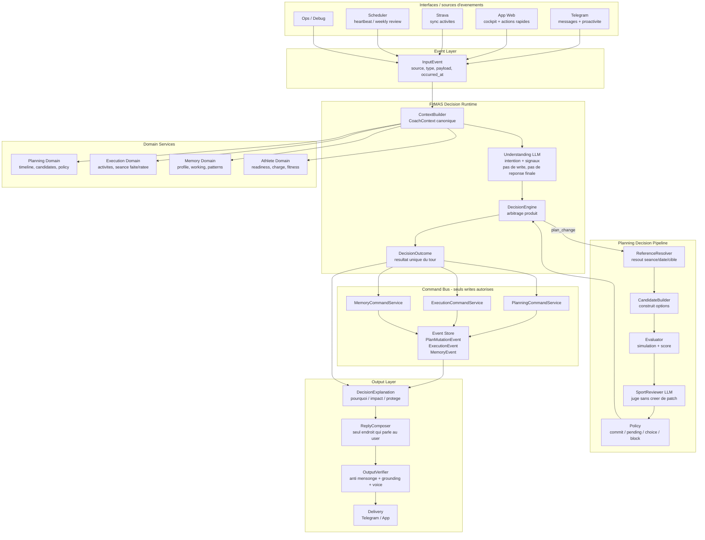
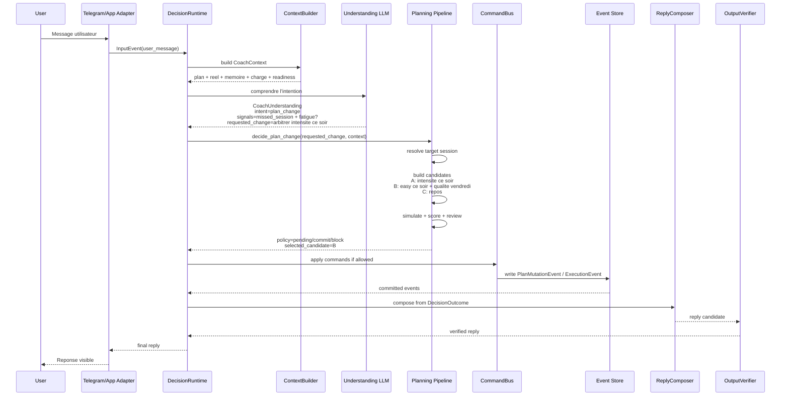

# FitMAS Decision Runtime Refactor

## Statut du document

Ce document devient le **canon de refactor architecture**.

Les anciens documents de coherence, autonomy, candidate flow, prompt context,
planning snapshot et reliability sont temporairement consideres comme
**legacy / contexte historique**. Ils peuvent contenir des briques utiles, mais
ils ne tranchent plus l'architecture cible.

Regle d'arbitrage :

```text
Ce document gagne sur les anciens plans de refactor.
BUILD-ORDER.md reste utile pour l'etat factuel du repo.
Le code reste la verite de ce qui est deja implemente.
```

## Etat implementation — 15 mai 2026

Phases 0 a 7 initiales sont livrees localement.

Livres dans la premiere tranche :

- package pur `backend/src/fitmas/decision/` ;
- types centraux : `InputEvent`, `CoachContext`, `CoachUnderstanding`,
  `RequestedPlanChange`, `DecisionExplanation`, `ReplyContract`, `Command`,
  `CommandResult`, `DecisionOutcome` ;
- protocoles shell : `CommandBus`, `DecisionRuntime`, `ReplyComposer`,
  `OutputVerifier` ;
- aucun import DB, SQLAlchemy, `PlanPatch`, `MutationDecision`, tools,
  `conversation_pipeline` ou legacy dans le package `decision/` ;
- tests Phase 0/1 :
  - `tests/test_decision_types.py`
  - `tests/test_decision_runtime_architecture.py`

Livres en Phase 2 initiale :

- `CoachContext` decoupe en contextes domaines : `LocalTimeContext`,
  `PlanTimeline`, `ExecutionReality`, `MemoryContext`, `AthleteContext`,
  `ReadinessContext`, `LoadContext`, `WeeklyRealityDigest`, `PendingContext` ;
- `DecisionContextBuilder` dans `fitmas.decision.context_builder`, importable
  depuis le sous-module uniquement pour eviter de charger la DB au simple import
  de `fitmas.decision` ;
- builder read-only depuis `InputEvent + DB`, base sur `ScheduledSession`,
  `Activity`, memoire active et `CoachStateBundle` ;
- aucun branchement de `conversation_pipeline`, heartbeat, app routes, prompts,
  tools ou writers sur le builder ;
- tests Phase 2 :
  - `tests/test_decision_context_builder.py`
  - extension de `tests/test_decision_runtime_architecture.py`

Livres en Phase 3 initiale :

- `CoachUnderstanding` renforce avec `UserSignal`, `PendingResolution` et
  `ClarificationNeed` ;
- conversion legacy isolee dans
  `backend/src/fitmas/legacy/coach_understanding_adapter.py` ;
- shadow understanding observability dans
  `backend/src/fitmas/legacy/understanding_shadow.py`, appele apres
  `decide()` sans influencer les branches runtime ;
- `decision/` reste libre de `fitmas.llm`, `PlanPatch`, `MutationDecision`,
  tools, DB writes et reponses visibles ;
- tests Phase 3 :
  - `tests/test_coach_understanding_adapter.py`
  - `tests/test_conversation_understanding_shadow.py`
  - extension de `tests/test_decision_types.py`
  - extension de `tests/test_decision_runtime_architecture.py`

Livres en Phase 4 initiale :

- `backend/src/fitmas/domain/planning/` cree comme bounded context cible ;
- `ReferenceResolver` resout uniquement des refs typees, jamais le texte user ;
- `PlanCandidateBuilder` construit les candidates backend depuis
  `RequestedPlanChange` ;
- evaluator/reviewer/policy existants sont reutilises derriere des facades
  domaine ;
- `PlanningCommandService` concentre les writes Phase 4 pour commit et pending ;
- `decide_plan_change()` devient l'entrypoint domaine :
  `RequestedPlanChange -> resolver -> candidates -> evaluator -> reviewer optionnel -> policy` ;
- `legacy/planning_runtime_adapter.py` existe pour relier l'ancien
  `CoachDecision` au nouveau runtime planning ;
- le cutover conversation est garde par `FITMAS_PLANNING_RUNTIME_CUTOVER=1`
  pour eviter de casser les flux dogfood tant que les replies Phase 5 ne sont
  pas migrees ;
- `PlanPatch` reste langage interne backend, pas sortie d'autorite du LLM.

Tests Phase 4 :

- `tests/test_domain_planning_models.py`
- `tests/test_domain_planning_reference_resolver.py`
- `tests/test_domain_planning_candidate_builder.py`
- `tests/test_domain_planning_evaluator_policy.py`
- `tests/test_domain_planning_mutation_service.py`
- `tests/test_domain_planning_decision_service.py`
- `tests/test_conversation_planning_runtime_adapter.py`
- `tests/test_phase4_planning_architecture.py`
- extension de `tests/test_decision_runtime_architecture.py`

Livres en Phase 5 initiale :

- `ReplyRequest` et `ReplyResult` ajoutent un contrat de parole pure dans
  `decision/` ;
- `DecisionReplyComposer` transforme `DecisionOutcome` en demande de reply,
  puis verifie la sortie ;
- `DecisionOutputVerifier` bloque claims sans event, jargon interne et voix
  invalide ;
- `legacy/final_reply_backend.py` devient le seul pont vers l'ancien
  `final_reply.py` ;
- les outcomes planning et PlanPatch legacy sont adaptes vers
  `DecisionOutcome` avant parole visible ;
- les helpers visibles PlanPatch de `conversation_pipeline.py` deleguent au
  composer ;
- l'adapter PlanPatch legacy conserve les verifications fines existantes :
  `verify_post_event_reply`, `verify_uncommitted_reply` et
  `verify_factual_reply` restent alimentes par les events, dates DB et details
  de patch ;
- le cutover conversation planning reste opt-in jusqu'a parite semantique
  flag-on.

Tests Phase 5 :

- `tests/test_decision_reply_composer.py`
- `tests/test_decision_output_verifier.py`
- `tests/test_legacy_final_reply_backend.py`
- `tests/test_planning_outcome_adapter.py`
- `tests/test_plan_patch_reply_adapter.py`
- `tests/test_conversation_planning_runtime_reply_composer.py`
- `tests/test_phase5_reply_architecture.py`
- extension de `tests/test_decision_runtime_architecture.py`
- `./scripts/test-backend -q` -> 1052 passed, 11 skipped, 11 subtests passed

Livres en Phase 6 initiale :

- plan d'execution :
  `docs/superpowers/plans/2026-05-14-decision-runtime-phase-6-prompts.md` ;
- `fitmas.llm` est devenu un package compatible avec l'ancien import
  `from fitmas.llm import ...` ;
- `fitmas.llm.gateway` contient l'implementation gateway, avec wrapper
  temporaire `fitmas.llm_gateway` ;
- les prompts canoniques vivent sous `fitmas.llm.prompts` ;
- les familles canoniques sont `Understanding`, `Reviewer`, `Reply` ;
- `plan_patch_candidate_reviewer.py` utilise le nouveau prompt Reviewer ;
- `final_reply.py` utilise le nouveau prompt Reply ;
- Understanding existe en prompt shadow teste, sans cutover runtime ;
- l'ancien stack `CoachDecision` / `conversation_prompt_modules.py` reste
  legacy compat jusqu'au cutover ;
- aucun changement runtime par defaut tant que les snapshots et dogfood ne
  prouvent pas la parite.

Tests Phase 6 :

- `tests/test_llm_package_compat.py`
- `tests/test_llm_prompt_contracts.py`
- `tests/test_llm_prompts_base.py`
- `tests/test_llm_prompts_understanding.py`
- `tests/test_llm_prompts_reviewer.py`
- `tests/test_llm_prompts_reply.py`
- `tests/test_phase6_prompt_architecture.py`
- `./scripts/test-backend -q` -> 1070 passed, 11 skipped, 11 subtests passed

Livres en Phase 7 initiale :

- plan d'execution :
  `docs/superpowers/plans/2026-05-14-decision-runtime-phase-7-heartbeat-runtime.md` ;
- `backend/src/fitmas/legacy/heartbeat_runtime_adapter.py` convertit un
  trigger heartbeat legacy en `InputEvent`, `DecisionOutcome` et resultat de
  delivery compatible `CoachDraft` ;
- `CoachDraft | None` est mappe vers `DecisionOutcome(kind="answer" |
  "plan_pending" | "no_send")` ;
- `DecisionOutputVerifier` peut tourner en shadow ou en enforcement via
  `FITMAS_HEARTBEAT_RUNTIME_VERIFY_ENFORCE=1` ;
- `backend/src/fitmas/app/telegram/scheduler.py` devient le nouveau module
  cible pour le scheduler Telegram ;
- `backend/src/fitmas/telegram_scheduler.py` reste wrapper compat ;
- `FITMAS_HEARTBEAT_RUNTIME_CUTOVER=1` route scheduler, `/heartbeat`, debug
  heartbeat et ops heartbeat via l'adapter ;
- cutover off par defaut : les chemins dogfood existants restent inchanges ;
- les prompts, tool-loop, guards et debug traces heartbeat restent legacy
  jusqu'a Phase 8.

Stabilisation associee :

- `execution_mutation_service` resout maintenant aussi les `target_ref` ISO
  produits par un LLM (`YYYY-MM-DD` ou `date:YYYY-MM-DD`) contre la verite DB ;
- cela reste deterministe sur artefact type, sans parsing du texte utilisateur
  libre.

Tests Phase 7 :

- `tests/test_heartbeat_runtime_adapter.py`
- `tests/test_telegram_scheduler_runtime_adapter.py`
- `tests/test_phase7_heartbeat_architecture.py`
- extensions de `tests/test_telegram_scheduler.py`
- extensions de `tests/test_telegram_commands.py`
- extensions de `tests/test_heartbeat_debug_endpoint.py`
- verification heartbeat existante :
  `./scripts/test-backend -q tests/test_heartbeat_tool_loop.py tests/test_heartbeat_debug_endpoint.py tests/test_heartbeat_grounding.py`
  -> 40 passed
- smoke reel :
  `./scripts/smoke-real-conversations --scenario heartbeat_non_completion`
  -> exit 0, renfo J-1 marque `skipped`
- verification complete :
  `./scripts/test-backend -q` -> 1094 passed, 11 skipped,
  11 subtests passed

Livres en Phase 8A :

- plan d'execution :
  `docs/superpowers/plans/2026-05-14-decision-runtime-phase-8a-legacy-audit.md` ;
- kill list canonique :
  `docs/DECISION-RUNTIME-LEGACY-KILL-LIST.md` ;
- inventaire explicite des importeurs `CoachDecision` / `MutationDecision` ;
- inventaire explicite des callers directs de `fitmas.final_reply` ;
- suivi documente des flags `FITMAS_PLANNING_RUNTIME_CUTOVER`,
  `FITMAS_HEARTBEAT_RUNTIME_CUTOVER` et
  `FITMAS_HEARTBEAT_RUNTIME_VERIFY_ENFORCE` ;
- suivi documente des tools compat : `suggest_replan_candidates`,
  `propose_replan` et `draft_*` ;
- aucun code runtime supprime, aucun cutover active par defaut.

Tests Phase 8A :

- `tests/test_phase8a_legacy_audit.py`
- verification ciblee :
  `./scripts/test-backend -q tests/test_phase8a_legacy_audit.py`
  -> 5 passed

Livres en Phase 8B :

- plan d'execution :
  `docs/superpowers/plans/2026-05-14-decision-runtime-phase-8b-cutover-parity.md` ;
- harness cutover :
  `scripts/smoke-decision-runtime-cutover` ;
- `PlanningRuntimeAdapterAttempt` distingue maintenant :
  `not applicable`, `handled`, `applicable but unhandled` ;
- `conversation_pipeline.py` route les decisions planning applicables vers le
  runtime sous `FITMAS_PLANNING_RUNTIME_CUTOVER=1` avant la branche mixed
  legacy ;
- si une demande planning typee est applicable mais non geree par le runtime,
  elle devient un `planning_runtime_unhandled` bloque, pas un fallthrough legacy ;
- tests heartbeat cutover renforces autour de
  `FITMAS_HEARTBEAT_RUNTIME_VERIFY_ENFORCE=1` ;
- aucun cutover active par defaut, aucun fichier legacy supprime.

Tests Phase 8B :

- `tests/test_phase8b_cutover_harness.py`
- `tests/test_phase8b_planning_cutover.py`
- `tests/test_phase8b_heartbeat_cutover.py`
- `tests/test_phase8b_cutover_architecture.py`
- flag-on unit gate :
  `FITMAS_PLANNING_RUNTIME_CUTOVER=1 FITMAS_HEARTBEAT_RUNTIME_CUTOVER=1 FITMAS_HEARTBEAT_RUNTIME_VERIFY_ENFORCE=1 ./scripts/test-backend -q tests/test_conversation_planning_runtime_adapter.py tests/test_conversation_planning_runtime_reply_composer.py tests/test_phase8b_planning_cutover.py tests/test_heartbeat_runtime_adapter.py tests/test_telegram_scheduler_runtime_adapter.py tests/test_phase8b_heartbeat_cutover.py`
  -> 30 passed
- harness reel :
  `./scripts/smoke-decision-runtime-cutover`
  -> exit 0 ; unit gates 28 passed ; smokes conversation
  `heartbeat_non_completion`, `compound_non_completion_swap`,
  `golden_case_autonomy`, `today_unavailability` executes ; A+ API
  `move_easy_then_confirm` -> OK
- verification complete :
  `./scripts/test-backend -q` -> 1111 passed, 11 skipped,
  11 subtests passed

Livres en Phase 8C :

- plan d'execution :
  `docs/superpowers/plans/2026-05-14-decision-runtime-phase-8c-legacy-kill.md` ;
- `conversation_pipeline.py` ne contient plus les routes actives
  `response_type == "plan_patch"`, `response_type == "requires_confirmation"`
  ou `response_type == "mutation_decision"` comme writers directs ;
- les `MutationDecision` mutantes sont bloquees comme
  `legacy_decision_contract_disabled`, sans write ; le cas `no_change` reste
  read-only et passe par le composer commun ;
- `conversation_pipeline.py` n'importe plus `fitmas.final_reply` directement :
  la compat passe par `legacy/conversation_reply_adapter.py` ;
- heartbeat Telegram utilise l'adapter runtime par defaut, avec opt-out env
  explicite ;
- `tools/registry.py` ne publie plus `propose_replan` ni les `draft_*` ;
- `legacy/tools_compat.py`, `legacy/weekly_plan_compat.py` et
  `legacy/decision_contracts.py` concentrent les ponts historiques restants ;
- `plan_mutation_service.py` et `api_read.py` lisent la verite runtime depuis
  `ScheduledSession`, pas depuis `WeeklyPlan` / `DayPlan` ;
- les tools `draft_*` sortent du contrat prompt health signal.

Tests Phase 8C :

- `tests/test_phase8c_legacy_kill_architecture.py`
- core flows legacy remis au contrat 8C :
  `MutationDecision` mutante = bloque, no-change = read-only ;
- verification architecture Phase 8 :
  `./scripts/test-backend -q tests/test_decision_runtime_architecture.py tests/test_phase8a_legacy_audit.py tests/test_phase8b_cutover_architecture.py tests/test_phase8c_legacy_kill_architecture.py`
  -> 24 passed
- verification complete :
  `./scripts/test-backend -q` -> 1116 passed, 11 skipped,
  11 subtests passed
- harness reel :
  `./scripts/smoke-decision-runtime-cutover` -> exit 0

Livres en Phase 8D :

- plan d'execution :
  `docs/superpowers/plans/2026-05-14-decision-runtime-phase-8d-bridge-shrink.md` ;
- `DecisionRuntimeService` existe dans `decision/runtime.py` comme shell pur :
  `ContextBuilder -> Understanding -> DecisionEngine -> CommandBus -> ReplyComposer` ;
- `/api/v0/messages` vit maintenant sous
  `backend/src/fitmas/app/api/routes_messages.py` ; `api_messages.py` reste un
  wrapper compat pour les tests, monkeypatchs et anciens importeurs ;
- les helpers cutover planning conversation vivent dans
  `legacy/conversation_planning_bridge.py` ;
- les replies read-only/no-change conversationnelles vivent dans
  `legacy/conversation_readonly_reply_bridge.py` ;
- les helpers de forme `CoachDecision` / legacy readonly vivent dans
  `legacy/conversation_decision_bridge.py` ;
- les wrappers racine heartbeat passent par
  `legacy/heartbeat_skill_bridge.py`, pour garder les imports skill-loop hors
  entrypoints actifs ;
- `conversation_pipeline.py` est reduit sous le budget 8D :
  3459 lignes apres extraction.

Tests Phase 8D :

- `tests/test_phase8d_bridge_shrink_architecture.py`
- `tests/test_decision_runtime_service.py`
- `tests/test_app_api_routes_messages.py`
- verification ciblee API/conversation/heartbeat :
  `tests/test_app_api_routes_messages.py tests/test_core_flows.py tests/test_conversation_debug_endpoint.py tests/test_heartbeat_runtime_adapter.py tests/test_telegram_scheduler_runtime_adapter.py tests/test_telegram_commands.py tests/test_heartbeat_debug_endpoint.py`
  -> passed localement
- verification complete :
  `./scripts/test-backend -q` -> 1130 passed, 11 skipped,
  11 subtests passed
- harness reel :
  `./scripts/smoke-decision-runtime-cutover` -> RESULT: OK

Livres en Phase 8E :

- plan d'execution :
  `docs/superpowers/plans/2026-05-14-decision-runtime-phase-8e-understanding-cutover.md` ;
- `LLMUnderstandingService` existe sous
  `backend/src/fitmas/llm/understanding_service.py` ;
- le parser retourne `CoachUnderstanding | None`, jamais `CoachDecision` ;
- le parser refuse les champs de parole visible, patch planning, mutation
  legacy et commandes ;
- le parser neutralise les artefacts planning/pending/clarification quand
  l'intent canonique ne correspond pas ;
- `conversation_understanding_bridge.py` appelle Understanding en shadow
  opt-in via `FITMAS_UNDERSTANDING_RUNTIME_SHADOW=1` ;
- `FITMAS_UNDERSTANDING_RUNTIME_SHADOW` reste off par defaut ;
- `FITMAS_UNDERSTANDING_RUNTIME_PLANNING_CUTOVER` reste off par defaut ;
- `planning_runtime_adapter.py` peut consommer un
  `CoachUnderstanding.requested_change` canonique quand le flag cutover est
  actif et que l'intent canonique est `plan_change` ;
- `conversation_pipeline.py` ne connait que le bridge legacy, pas le service
  LLM ni le prompt Understanding ;
- `CoachDecision` reste fallback actions/reply jusqu'a la prochaine phase.

Tests Phase 8E :

- `tests/test_phase8e_understanding_cutover_architecture.py`
- `tests/test_llm_understanding_service.py`
- `tests/test_conversation_understanding_bridge.py`
- extensions de `tests/test_conversation_planning_runtime_adapter.py`
- extensions de `tests/test_core_flows.py`
- extension de `tests/test_conversation_debug_endpoint.py`
- gates architecture/behavior ciblees :
  `./scripts/test-backend -q tests/test_core_flows.py tests/test_conversation_debug_endpoint.py tests/test_phase8e_understanding_cutover_architecture.py`
  -> 129 passed ;
- gates prompts/planning/runtime :
  `./scripts/test-backend -q tests/test_llm_understanding_service.py tests/test_conversation_understanding_bridge.py tests/test_conversation_planning_runtime_adapter.py tests/test_llm_prompts_understanding.py tests/test_phase6_prompt_architecture.py`
  -> 23 passed ;
- gates architecture runtime :
  `./scripts/test-backend -q tests/test_decision_runtime_architecture.py tests/test_phase8d_bridge_shrink_architecture.py tests/test_phase8b_planning_cutover.py tests/test_conversation_planning_runtime_reply_composer.py`
  -> 32 passed ;
- verification complete :
  `./scripts/test-backend -q` -> 1153 passed, 11 skipped,
  11 subtests passed ;
- harness cutover :
  `./scripts/smoke-decision-runtime-cutover` -> unit gates 28 passed ;
  tentative full harness final interrompue pendant `smoke-real-conversations`
  apres stall provider, sans assertion code exploitable ;
- smoke Understanding shadow opt-in :
  `FITMAS_UNDERSTANDING_RUNTIME_SHADOW=1 ./scripts/smoke-real-conversations --scenario heartbeat_non_completion`
  -> exit 0, log `decision_runtime.canonical_understanding`
  avec `requested_change=0` sur `execution_report`.

Livres en Phase 8F :

- plan d'execution :
  `docs/superpowers/plans/2026-05-14-decision-runtime-phase-8f-command-extraction.md` ;
- `legacy/coach_command_adapter.py` compile les artefacts types legacy en
  `Command` sans DB, sans write, sans parsing du texte utilisateur libre ;
- `legacy/conversation_command_bus.py` est le seul nouvel adapter writer
  memoire/execution : il delegue aux services existants et retourne des
  `CommandResult` event-backed ;
- `legacy/conversation_command_bridge.py` preserve les metriques et
  `turn_memory_writes` historiques en passant par le bus ;
- `memory_mutation_service` et `execution_mutation_service` retournent les ids
  des `MemoryMutationEventRecord` crees ;
- `conversation_pipeline.py` ne call plus directement
  `apply_memory_actions_for_user` ni `apply_execution_actions_for_user` ;
- `conversation_pipeline.py` est reduit a 3219 lignes apres extraction 8F ;
- `FITMAS_COMMANDS_FROM_UNDERSTANDING` prepare la compilation depuis
  `CoachUnderstanding.extracted_signals`, off par defaut ;
- le prompt Understanding documente les payloads types utiles aux commandes
  futures sans autoriser de write.

Tests Phase 8F :

- `tests/test_phase8f_command_extraction_architecture.py`
- `tests/test_coach_command_adapter.py`
- `tests/test_conversation_command_bus.py`
- `tests/test_conversation_command_bridge.py`
- extensions de `tests/test_memory_mutation_service.py`
- extensions de `tests/test_llm_prompts_understanding.py`
- extensions de `tests/test_core_flows.py`
- extension de `tests/test_conversation_debug_endpoint.py`
- gates ciblees 8F :
  `./scripts/test-backend -q tests/test_phase8f_command_extraction_architecture.py tests/test_memory_mutation_service.py tests/test_coach_command_adapter.py tests/test_conversation_command_bus.py tests/test_conversation_command_bridge.py tests/test_llm_prompts_understanding.py tests/test_llm_understanding_service.py`
  -> 32 passed ;
- architecture pack Phase 8 :
  `./scripts/test-backend -q tests/test_decision_runtime_architecture.py tests/test_phase8a_legacy_audit.py tests/test_phase8b_cutover_architecture.py tests/test_phase8c_legacy_kill_architecture.py tests/test_phase8d_bridge_shrink_architecture.py tests/test_phase8e_understanding_cutover_architecture.py tests/test_phase8f_command_extraction_architecture.py`
  -> 45 passed ;
- verification complete :
  `./scripts/test-backend -q` -> 1167 passed, 11 skipped,
  11 subtests passed ;
- smoke Understanding shadow opt-in :
  `FITMAS_UNDERSTANDING_RUNTIME_SHADOW=1 ./scripts/smoke-real-conversations --scenario heartbeat_non_completion`
  -> exit 0, log `command_source=coach_decision`, renfo J-1 marque
  `skipped` ;
- harness cutover :
  `./scripts/smoke-decision-runtime-cutover` -> unit gates 28 passed ;
  smokes conversation ont exerce `command_source=coach_decision` sur actions
  memoire/execution ; run interrompu ensuite pendant un stall provider
  DeepSeek JSON sur un cas planning, sans assertion code exploitable.

Dette restante apres Phase 8F :

- `CoachDecision` reste contrat provider legacy ;
- `pending_resolution` reste porte par `CoachDecision` ;
- les services root memoire/execution seront deplaces vers
  `domain/memory` et `domain/execution` dans une phase ulterieure ;
- l'activation par defaut des commandes depuis `CoachUnderstanding` attend
  dogfood/parite sous flag.

Livres en Phase 8G :

- plan d'execution :
  `docs/superpowers/plans/2026-05-14-decision-runtime-phase-8g-pending-resolution.md` ;
- `legacy/conversation_pending_bridge.py` devient la frontiere unique de
  resolution pending conversation ;
- `conversation_pipeline.py` ne definit plus les helpers
  `_apply_pending_resolution`, `_verify_pending_accept_resolution`,
  `_accept_pending_confirmation`, `_accept_pending_plan_patch_choice`,
  `_outcome_keeps_pending_confirmation` ou
  `_keep_pending_for_non_mutating_turn` ;
- `conversation_pipeline.py` ne lit plus `decision.pending_resolution`
  directement ;
- le bridge pending applique `plan_patch` et `plan_patch_choice` via
  `apply_patch_for_user`, donc toujours via `PlanMutationService` ;
- le recheck pending reste LLM JSON-only et ne parse pas le texte utilisateur
  libre avec regex/keywords ;
- `FITMAS_PENDING_FROM_UNDERSTANDING` prepare la consommation de
  `CoachUnderstanding.pending_resolution`, off par defaut ;
- les metriques conversation comptent maintenant la pending depuis la source
  legacy ou canonique via le bridge ;
- `conversation_pipeline.py` est reduit a 2731 lignes apres extraction 8G.

Tests Phase 8G :

- `tests/test_phase8g_pending_resolution_architecture.py`
- `tests/test_conversation_pending_bridge.py`
- extensions de `tests/test_core_flows.py`
- gates ciblees 8G :
  `./scripts/test-backend -q tests/test_phase8g_pending_resolution_architecture.py tests/test_conversation_pending_bridge.py`
  -> 8 passed ;
- parite pending existante :
  `./scripts/test-backend -q tests/test_core_flows.py -k "pending or confirmation"`
  -> 33 passed ;
- architecture pack Phase 8 :
  `./scripts/test-backend -q tests/test_decision_runtime_architecture.py tests/test_phase8a_legacy_audit.py tests/test_phase8b_cutover_architecture.py tests/test_phase8c_legacy_kill_architecture.py tests/test_phase8d_bridge_shrink_architecture.py tests/test_phase8e_understanding_cutover_architecture.py tests/test_phase8f_command_extraction_architecture.py tests/test_phase8g_pending_resolution_architecture.py`
  -> 49 passed ;
- verification complete :
  `./scripts/test-backend -q` -> 1175 passed, 11 skipped,
  11 subtests passed ;
- smokes API reels :
  `./scripts/smoke-a-plus-api --scenario move_easy_then_confirm --timeout 60`
  -> RESULT: OK, provider a clarifie sans creer de pending ;
  `./scripts/smoke-a-plus-api --scenario confirm_without_pending --timeout 60`
  -> RESULT: OK, events=+0, pending=+0.

Dette restante apres Phase 8G :

- `CoachDecision` reste contrat provider legacy ;
- `CoachDecision.pending_resolution` reste source par defaut tant que
  `FITMAS_PENDING_FROM_UNDERSTANDING` est off ;
- les replies visibles reject/ignore/clarification pending restent
  legacy-compat dans le bridge et devront passer par `ReplyComposer` dans un
  cleanup dedie ;
- les services root memoire/execution et certains writes planning candidate
  restent a deplacer vers les domaines cibles.

Livres en Phase 8H :

- plan d'execution :
  `docs/superpowers/plans/2026-05-15-decision-runtime-phase-8h-pending-reply-cleanup.md` ;
- `legacy/pending_reply_adapter.py` convertit les modes pending non
  commitants en `DecisionOutcome` ;
- `legacy/conversation_pending_bridge.py` ne lit plus
  `decision.fitmas_message` pour parler au user ;
- reject / ignore / modify / needs_clarification / expired / inactive /
  choice-error passent par `DecisionReplyComposer` ;
- les pending `PlanPatch` acceptees ou bloquees restent event-backed via
  l'adapter planning existant ;
- `DecisionReplyComposer` force une vraie demande de confirmation quand une
  pending vient d'etre creee ;
- les `next_step` planning visibles ne sont plus des sentinelles techniques
  (`await_user_confirmation`, `await_user_choice`).

Tests Phase 8H :

- `tests/test_phase8h_pending_reply_architecture.py`
- `tests/test_pending_reply_adapter.py`
- extensions de `tests/test_conversation_pending_bridge.py`
- extensions de `tests/test_decision_reply_composer.py`
- extensions de `tests/test_planning_outcome_adapter.py`
- gates ciblees 8H :
  `./scripts/test-backend -q tests/test_phase8h_pending_reply_architecture.py tests/test_pending_reply_adapter.py tests/test_conversation_pending_bridge.py tests/test_decision_reply_composer.py tests/test_planning_outcome_adapter.py`
  -> 24 passed ;
- parite pending / confirmation :
  `./scripts/test-backend -q tests/test_core_flows.py -k "pending or confirmation"`
  -> 33 passed ;
- architecture pack Phase 8 :
  `./scripts/test-backend -q tests/test_decision_runtime_architecture.py tests/test_phase8a_legacy_audit.py tests/test_phase8b_cutover_architecture.py tests/test_phase8c_legacy_kill_architecture.py tests/test_phase8d_bridge_shrink_architecture.py tests/test_phase8e_understanding_cutover_architecture.py tests/test_phase8f_command_extraction_architecture.py tests/test_phase8g_pending_resolution_architecture.py tests/test_phase8h_pending_reply_architecture.py`
  -> 52 passed ;
- verification complete :
  `./scripts/test-backend -q` -> 1187 passed, 11 skipped,
  11 subtests passed ;
- smokes API reels :
  `./scripts/smoke-a-plus-api --scenario move_easy_then_confirm --timeout 60`
  -> RESULT: OK, pending plan_patch creee, events=+0 ;
  `./scripts/smoke-a-plus-api --scenario confirm_without_pending --timeout 60`
  -> RESULT: OK, events=+0, pending=+0.

Dette restante apres Phase 8H :

- `CoachDecision` reste contrat provider legacy ;
- `CoachDecision.pending_resolution` reste source par defaut tant que
  `FITMAS_PENDING_FROM_UNDERSTANDING` est off ;
- `FITMAS_COMMANDS_FROM_UNDERSTANDING` reste off par defaut ;
- `final_reply.py` reste backend legacy pour certaines replies composees ;
- `conversation_pipeline.py` reste trop gros et doit continuer a shrinker ;
- les services root memoire/execution/planning doivent encore rejoindre les
  domaines cibles.

Livres en Phase 8I :

- plan d'execution :
  `docs/superpowers/plans/2026-05-15-decision-runtime-phase-8i-canonical-flag-dogfood.md` ;
- `tests/test_phase8i_canonical_flag_dogfood_architecture.py` verrouille les
  flags canoniques et le wrapper smoke ;
- `tests/test_conversation_command_bridge.py` prouve que
  `FITMAS_COMMANDS_FROM_UNDERSTANDING=1` peut appliquer des commandes memoire
  et execution depuis `CoachUnderstanding` ;
- le fallback vers `CoachDecision` reste explicite quand l'Understanding ne
  porte aucune commande exploitable ;
- `tests/test_conversation_pending_bridge.py` prouve que
  `FITMAS_PENDING_FROM_UNDERSTANDING=1` peut faire gagner une resolution
  pending canonique, et fallback legacy si elle est absente ;
- `scripts/smoke-decision-runtime-canonical-flags` lance les dogfoods avec :
  `FITMAS_UNDERSTANDING_RUNTIME_SHADOW=1`,
  `FITMAS_COMMANDS_FROM_UNDERSTANDING=1`,
  `FITMAS_PENDING_FROM_UNDERSTANDING=1` ;
- `FITMAS_UNDERSTANDING_RUNTIME_PLANNING_CUTOVER=1` reste exclu du wrapper
  par defaut.

Tests Phase 8I :

- targeted 8I :
  `./scripts/test-backend -q tests/test_phase8i_canonical_flag_dogfood_architecture.py tests/test_conversation_understanding_bridge.py tests/test_conversation_command_bridge.py tests/test_conversation_pending_bridge.py`
  -> 21 passed ;
- architecture pack Phase 8 :
  `./scripts/test-backend -q tests/test_decision_runtime_architecture.py tests/test_phase8a_legacy_audit.py tests/test_phase8b_cutover_architecture.py tests/test_phase8c_legacy_kill_architecture.py tests/test_phase8d_bridge_shrink_architecture.py tests/test_phase8e_understanding_cutover_architecture.py tests/test_phase8f_command_extraction_architecture.py tests/test_phase8g_pending_resolution_architecture.py tests/test_phase8h_pending_reply_architecture.py tests/test_phase8i_canonical_flag_dogfood_architecture.py`
  -> 55 passed ;
- verification complete :
  `./scripts/test-backend -q` -> 1197 passed, 11 skipped,
  11 subtests passed ;
- wrapper canonical :
  `./scripts/smoke-decision-runtime-canonical-flags`
  -> unit gates 18 passed, real conversation smokes termines, API smokes
  `move_easy_then_confirm` et `confirm_without_pending` -> RESULT: OK
  (2 checks) ;
- durcissement post-8I duplicate pending :
  `./scripts/test-backend -q tests/test_core_flows.py -k "canonical_pending_accept_survives_legacy_decide_none or canonical_pending_accept_preempts_legacy_decide"`
  -> 2 passed ;
- gate pending/core apres durcissement :
  `./scripts/test-backend -q tests/test_conversation_pending_bridge.py tests/test_core_flows.py -k "pending or canonical_pending_accept_survives_legacy_decide_none or canonical_pending_accept_preempts_legacy_decide"`
  -> 40 passed ;
- probe planning cutover explicite :
  `FITMAS_UNDERSTANDING_RUNTIME_SHADOW=1 FITMAS_COMMANDS_FROM_UNDERSTANDING=1 FITMAS_PENDING_FROM_UNDERSTANDING=1 FITMAS_UNDERSTANDING_RUNTIME_PLANNING_CUTOVER=1 ./scripts/smoke-a-plus-api --scenario move_easy_then_confirm --timeout 240`
  -> RESULT: OK, `events=+1`, `pending=+1`, `mode=pending_accepted` ;
  la pending initiale est acceptee, aucune deuxieme pending n'est creee.

Dette restante apres Phase 8I :

- les flags canoniques restent off par defaut ;
- `CoachDecision` reste contrat provider runtime ;
- le wrapper canonical montre que les smokes ciblés passent, mais les appels
  provider restent lents sous shadow Understanding ;
- certains tours reels restent source `coach_decision` quand
  `CoachUnderstanding` ne compile pas encore une commande exploitable ;
- le planning cutover canonique explicite ne duplique plus la pending sur
  `move_easy_then_confirm`, mais reste a dogfooder plus largement avant
  activation globale ;
- `conversation_pipeline.py` reste trop gros et doit continuer a shrinker ;
- les services root memoire/execution/planning doivent encore rejoindre les
  domaines cibles.

Livres en Phase 8J :

- plan d'execution :
  `docs/superpowers/plans/2026-05-15-decision-runtime-phase-8j-canonical-planning-cutover.md` ;
- `scripts/smoke-decision-runtime-canonical-planning` active explicitement :
  `FITMAS_UNDERSTANDING_RUNTIME_SHADOW=1`,
  `FITMAS_COMMANDS_FROM_UNDERSTANDING=1`,
  `FITMAS_PENDING_FROM_UNDERSTANDING=1`,
  `FITMAS_UNDERSTANDING_RUNTIME_PLANNING_CUTOVER=1` ;
- `tests/test_phase8j_canonical_planning_cutover_architecture.py` verrouille
  que le wrapper 8J existe, que 8I reste sans planning cutover, et que
  `decision/` reste pur ;
- `scripts/smoke_a_plus_api.py` echoue maintenant sur duplicate pending,
  confirmation nue qui write sous cutover canonique, et fuite de jargon
  `Candidate backend` dans une reply visible ;
- les builders candidats backend ne mettent plus `Candidate backend, pas une
  reponse finale` dans `PlanPatch.coach_message` ;
- `planning_outcome_adapter.py` n'expose plus les ids `backend:*` dans les
  candidate summaries envoyees au composer ;
- `coach_voice.py` et le smoke harness bloquent les fuites visibles
  `candidate backend`, `candidate possible` et `pas une reponse finale`.

Tests Phase 8J :

- targeted 8J :
  `./scripts/test-backend -q tests/test_phase8j_canonical_planning_cutover_architecture.py tests/test_smoke_a_plus_api.py -k "canonical_planning"`
  -> 8 passed ;
- pending/core cutover :
  `./scripts/test-backend -q tests/test_core_flows.py -k "canonical_pending_accept_survives_legacy_decide_none or canonical_pending_accept_preempts_legacy_decide or canonical_planning_cutover_confirmation_keeps_single_pending_row"`
  -> 3 passed ;
- architecture pack Phase 8 :
  `./scripts/test-backend -q tests/test_decision_runtime_architecture.py tests/test_phase8a_legacy_audit.py tests/test_phase8b_cutover_architecture.py tests/test_phase8c_legacy_kill_architecture.py tests/test_phase8d_bridge_shrink_architecture.py tests/test_phase8e_understanding_cutover_architecture.py tests/test_phase8f_command_extraction_architecture.py tests/test_phase8g_pending_resolution_architecture.py tests/test_phase8h_pending_reply_architecture.py tests/test_phase8i_canonical_flag_dogfood_architecture.py tests/test_phase8j_canonical_planning_cutover_architecture.py`
  -> 59 passed ;
- wrapper canonical planning :
  `./scripts/smoke-decision-runtime-canonical-planning`
  -> unit gates 8 passed, pending/core 3 passed, API matrix
  `move_easy_then_confirm`, `swap_by_day`, `lighten_tomorrow`,
  `replace_swim_with_bike`, `future_evening_unavailable`,
  `fatigue_tomorrow`, `avoid_back_to_back`,
  `swim_unavailable_two_weeks`, `confirm_without_pending`
  -> RESULT: OK (9 checks) ;
- verification complete :
  `./scripts/test-backend -q` -> 1207 passed, 11 skipped,
  11 subtests passed.

Dette restante apres Phase 8J :

- les flags canoniques restent off par defaut ;
- `CoachDecision` reste contrat provider runtime ;
- le planning cutover canonique passe la matrice stricte, mais les appels
  provider restent lents sous shadow Understanding ;
- certaines reponses de clarification planning restent a polir cote voix,
  mais les fuites de jargon backend sont maintenant bloquees ;
- `decide()` reste a refactorer apres decision 8K ;
- `conversation_pipeline.py` reste trop gros et doit continuer a shrinker ;
- les services root memoire/execution/planning doivent encore rejoindre les
  domaines cibles.

Livres en Phase 8K :

- plan d'execution :
  `docs/superpowers/plans/2026-05-15-decision-runtime-phase-8k-canonical-default-lanes.md` ;
- `FITMAS_COMMANDS_FROM_UNDERSTANDING` est default-on avec opt-out `0` ;
- `FITMAS_PENDING_FROM_UNDERSTANDING` est default-on avec opt-out `0` ;
- `FITMAS_CANONICAL_NON_PLANNING_CUTOVER` est default-on avec opt-out `0` ;
- l'Understanding canonique tourne par defaut seulement si un consumer
  non-planning peut utiliser l'artefact : pending actif, execution, sante,
  disponibilite, preference ou memoire ;
- `FITMAS_UNDERSTANDING_RUNTIME_SHADOW` reste off par defaut et conserve le
  mode explicite all-turn observability ;
- `FITMAS_UNDERSTANDING_RUNTIME_PLANNING_CUTOVER` reste off par defaut ;
- `scripts/smoke-decision-runtime-canonical-defaults` prouve les defaults sans
  exporter les flags commands/pending ;
- `conversation_pipeline.py` n'a pas grandi pour 8K : la bascule reste dans
  les bridges legacy controles.

Tests Phase 8K :

- targeted 8K :
  `./scripts/test-backend -q tests/test_phase8k_canonical_default_lanes_architecture.py tests/test_conversation_understanding_bridge.py tests/test_conversation_command_bridge.py tests/test_conversation_pending_bridge.py`
  -> 33 passed ;
- architecture pack Phase 8 :
  `./scripts/test-backend -q tests/test_decision_runtime_architecture.py tests/test_phase8a_legacy_audit.py tests/test_phase8b_cutover_architecture.py tests/test_phase8c_legacy_kill_architecture.py tests/test_phase8d_bridge_shrink_architecture.py tests/test_phase8e_understanding_cutover_architecture.py tests/test_phase8f_command_extraction_architecture.py tests/test_phase8g_pending_resolution_architecture.py tests/test_phase8h_pending_reply_architecture.py tests/test_phase8i_canonical_flag_dogfood_architecture.py tests/test_phase8j_canonical_planning_cutover_architecture.py tests/test_phase8k_canonical_default_lanes_architecture.py`
  -> 64 passed ;
- wrapper defaults :
  `./scripts/smoke-decision-runtime-canonical-defaults`
  -> unit gates 33 passed, real conversation smokes termines, API smokes
  `move_easy_then_confirm` et `confirm_without_pending` -> RESULT: OK
  (2 checks) ;
- wrapper planning opt-in :
  `./scripts/smoke-decision-runtime-canonical-planning`
  -> RESULT: OK (9 checks) ;
- verification complete :
  `./scripts/test-backend -q` -> 1222 passed, 11 skipped,
  11 subtests passed.

Dette restante apres Phase 8K :

- `CoachDecision` reste contrat provider runtime ;
- `decide()` reste a refactorer : 8K reduit son autorite effective mais ne
  le supprime pas ;
- le planning cutover canonique reste opt-in malgre la matrice 8J ;
- les appels provider supplementaires restent scopes mais doivent etre
  surveilles en dogfood reel ;
- `conversation_pipeline.py` et les services root doivent encore shrinker vers
  l'organisation cible.

Livres en Phase 8L :

- plan d'execution :
  `docs/superpowers/plans/2026-05-15-decision-runtime-phase-8l-decide-authority-shrink.md` ;
- `decide()` est consomme via
  `backend/src/fitmas/legacy/coach_decision_provider.py` ;
- `conversation_pipeline.py` ne call plus `dependencies.decide` directement ;
- `conversation_pipeline.py` ne depend plus de `llm_runtime` ;
- `conversation_pipeline.py` ne lit plus `decision.fitmas_message`
  directement ;
- `legacy/conversation_decide_bridge.py` construit la request legacy depuis
  les artefacts machine du tour et garde le contexte `decide_none` dans le
  `turn_context` ;
- `legacy/conversation_coach_decision_reply_bridge.py` porte la derniere
  fallback reply `CoachDecision` ;
- commands/pending canoniques restent default-on ;
- planning cutover canonique reste opt-in.

Tests Phase 8L :

- targeted 8L :
  `./scripts/test-backend -q tests/test_phase8l_decide_authority_architecture.py tests/test_coach_decision_provider.py tests/test_conversation_decide_bridge.py tests/test_conversation_coach_decision_reply_bridge.py tests/test_conversation_understanding_bridge.py tests/test_conversation_command_bridge.py tests/test_conversation_pending_bridge.py`
  -> 40 passed ;
- architecture pack Phase 8 :
  `./scripts/test-backend -q tests/test_decision_runtime_architecture.py tests/test_phase8a_legacy_audit.py tests/test_phase8b_cutover_architecture.py tests/test_phase8c_legacy_kill_architecture.py tests/test_phase8d_bridge_shrink_architecture.py tests/test_phase8e_understanding_cutover_architecture.py tests/test_phase8f_command_extraction_architecture.py tests/test_phase8g_pending_resolution_architecture.py tests/test_phase8h_pending_reply_architecture.py tests/test_phase8i_canonical_flag_dogfood_architecture.py tests/test_phase8j_canonical_planning_cutover_architecture.py tests/test_phase8k_canonical_default_lanes_architecture.py tests/test_phase8l_decide_authority_architecture.py`
  -> 70 passed ;
- wrapper decide shrink :
  `./scripts/smoke-decision-runtime-decide-shrink`
  -> RESULT: OK (8L gates, defaults canoniques et planning opt-in).
- verification complete :
  `./scripts/test-backend -q` -> 1234 passed, 11 skipped,
  11 subtests passed.

Dette restante apres Phase 8L :

- `CoachDecision` reste provider actif, mais son autorite runtime est bornee
  aux bridges legacy ;
- `llm/decision_legacy.py` reste a splitter en Phase 8M ;
- le planning cutover canonique reste opt-in ;
- `conversation_pipeline.py` reste trop gros, mais ne consomme plus le wire
  format `CoachDecision` directement.

Livres en Phase 8M :

- plan d'execution :
  `docs/superpowers/plans/2026-05-16-decision-runtime-phase-8m-decision-legacy-split.md` ;
- `backend/src/fitmas/llm/decision_legacy.py` devient un orchestrateur legacy
  plus fin : 2873 lignes avant 8M, 1467 lignes apres extraction ;
- contrats Pydantic legacy :
  `backend/src/fitmas/llm/legacy_models.py` ;
- parser / normalisation / guards de payload legacy :
  `backend/src/fitmas/llm/legacy_parser.py` ;
- construction du prompt conversation legacy :
  `backend/src/fitmas/llm/legacy_prompt.py` ;
- compilers et repairs action-only memoire/execution :
  `backend/src/fitmas/llm/legacy_action_compile.py` ;
- imports publics `fitmas.llm` conserves, y compris les classes pending
  typees ;
- monkeypatchs historiques `fitmas.llm._request_*` conserves par injection de
  la fonction request dans le compiler ;
- aucun changement de cutover : commands/pending canoniques default-on,
  planning cutover canonique opt-in.

Tests Phase 8M :

- targeted 8M :
  `./scripts/test-backend -q tests/test_phase8m_decision_legacy_split_architecture.py tests/test_llm_legacy_parser.py tests/test_llm_legacy_action_compile.py tests/test_llm_package_compat.py tests/test_coach_decision_actions.py tests/test_llm_json.py`
  -> 31 passed ;
- tool/decide regression :
  `./scripts/test-backend -q tests/test_llm_tools.py tests/test_decide_error_typing.py tests/test_core_flows.py -k "tool or decide_accepts_coach_decision_plan_patch_payload or decision_legacy or activity_highlights"`
  -> 67 passed, 126 deselected ;
- pending compat regression :
  `./scripts/test-backend -q tests/test_conversation_pending_bridge.py tests/test_llm_package_compat.py tests/test_phase8m_decision_legacy_split_architecture.py`
  -> 18 passed ;
- wrapper decision legacy split :
  `./scripts/smoke-decision-runtime-decision-legacy-split`
  -> RESULT: OK (100 8M/decide tests, 8L gates, defaults canoniques,
  planning opt-in).
- architecture pack Phase 8 complet :
  `./scripts/test-backend -q tests/test_decision_runtime_architecture.py tests/test_phase8a_legacy_audit.py tests/test_phase8b_cutover_architecture.py tests/test_phase8c_legacy_kill_architecture.py tests/test_phase8d_bridge_shrink_architecture.py tests/test_phase8e_understanding_cutover_architecture.py tests/test_phase8f_command_extraction_architecture.py tests/test_phase8g_pending_resolution_architecture.py tests/test_phase8h_pending_reply_architecture.py tests/test_phase8i_canonical_flag_dogfood_architecture.py tests/test_phase8j_canonical_planning_cutover_architecture.py tests/test_phase8k_canonical_default_lanes_architecture.py tests/test_phase8l_decide_authority_architecture.py tests/test_phase8m_decision_legacy_split_architecture.py`
  -> 76 passed ;
- verification complete :
  `./scripts/test-backend -q` -> 1245 passed, 11 skipped,
  11 subtests passed.

Dette restante apres Phase 8M :

- `CoachDecision` reste contrat provider actif ;
- `decision_legacy.py` orchestre encore provider/tool-loop/retry/reparations
  schema et quelques fonctions onboarding ;
- le prochain shrink doit viser le tool-loop/provider retry ou la sortie
  complete du contrat `CoachDecision`, pas recreer une logique dans
  `conversation_pipeline.py`.

Livres en Phase 8N :

- plan d'execution :
  `docs/superpowers/plans/2026-05-17-decision-runtime-phase-8n-provider-tool-loop-extraction.md` ;
- provider legacy extrait dans `backend/src/fitmas/llm/legacy_provider.py` :
  `_client`, `_request_text`, `_request_message`, `_request_json`,
  `_request_structured_json`, DeepSeek structured et classification erreur ;
- schema repair legacy extrait dans
  `backend/src/fitmas/llm/legacy_schema_repair.py` :
  repair payload invalide, fallback Claude schema, prose -> JSON,
  resumes tools avec payloads ;
- tool-loop legacy extrait dans `backend/src/fitmas/llm/legacy_tool_loop.py` :
  boucle tool-use, follow-up tool result, compiler JSON, retry JSON,
  traces tool ;
- `backend/src/fitmas/llm/decision_legacy.py` descend de 1467 lignes apres
  8M a 941 lignes apres 8N ;
- les shims publics prives `fitmas.llm._request_*`,
  `fitmas.llm._request_json_with_tools`, `execute_tool_calls` et
  `log_tool_trace` restent patchables par les tests historiques ;
- aucun changement de cutover : commands/pending canoniques default-on,
  planning cutover canonique opt-in.

Tests Phase 8N :

- provider / schema / tool-loop / compat :
  `./scripts/test-backend -q tests/test_llm_package_compat.py tests/test_llm_legacy_provider.py tests/test_llm_legacy_schema_repair.py tests/test_llm_legacy_tool_loop.py tests/test_phase8n_provider_tool_loop_architecture.py`
  -> 23 passed ;
- prompt observability :
  `./scripts/test-backend -q tests/test_prompt_observability.py`
  -> 8 passed ;
- decide / tools / CoachDecision regression :
  `./scripts/test-backend -q tests/test_llm_tools.py tests/test_decide_error_typing.py tests/test_coach_decision_actions.py`
  -> 87 passed ;
- tool-loop regression :
  `./scripts/test-backend -q tests/test_llm_legacy_tool_loop.py tests/test_llm_tools.py -k "tool"`
  -> 70 passed ;
- wrapper provider/tool-loop :
  `./scripts/smoke-decision-runtime-provider-tool-loop`
  -> RESULT: OK (118 tests 8N/decide, 8M split, 8L gates,
  defaults canoniques, planning cutover opt-in).
- architecture pack Phase 8 complet :
  `./scripts/test-backend -q tests/test_decision_runtime_architecture.py tests/test_phase8a_legacy_audit.py tests/test_phase8b_cutover_architecture.py tests/test_phase8c_legacy_kill_architecture.py tests/test_phase8d_bridge_shrink_architecture.py tests/test_phase8e_understanding_cutover_architecture.py tests/test_phase8f_command_extraction_architecture.py tests/test_phase8g_pending_resolution_architecture.py tests/test_phase8h_pending_reply_architecture.py tests/test_phase8i_canonical_flag_dogfood_architecture.py tests/test_phase8j_canonical_planning_cutover_architecture.py tests/test_phase8k_canonical_default_lanes_architecture.py tests/test_phase8l_decide_authority_architecture.py tests/test_phase8m_decision_legacy_split_architecture.py tests/test_phase8n_provider_tool_loop_architecture.py`
  -> 83 passed ;
- verification complete :
  `./scripts/test-backend -q` -> 1266 passed, 11 skipped,
  11 subtests passed.

Dette restante apres Phase 8N :

- `CoachDecision` reste contrat provider actif ;
- `decision_legacy.py` orchestre encore `decide()` et porte les helpers legacy
  onboarding, week-plan et facts ;
- le prochain slice doit viser soit la reduction du contrat `CoachDecision`,
  soit la sortie des helpers onboarding/facts hors `decision_legacy.py` ;
- le planning cutover canonique reste opt-in tant que les dogfood gates ne
  justifient pas le default-enable.

Livres en Phase 8O :

- plan d'execution :
  `docs/superpowers/plans/2026-05-17-decision-runtime-phase-8o-coachdecision-artifact-boundary.md` ;
- `backend/src/fitmas/legacy/coach_decision_artifact.py` cree une frontiere
  neutre `LegacyCoachDecisionArtifact` entre le provider LLM legacy et le
  runtime conversation ;
- `CoachDecisionResult` transporte maintenant `artifact` et `raw_decision` :
  le runtime consomme l'artifact, le brut reste compat provider/test ;
- `conversation_pipeline.py` recoit `legacy_decision_artifact` depuis
  `conversation_decide_bridge`, plus un objet `CoachDecision` brut ;
- les bridges conversation-facing command, pending, planning, readonly/reply et
  shadow Understanding lisent `reply_hint`, `response_type`, `plan_patch`,
  `pending_resolution`, `memory_actions` et `execution_actions` depuis
  l'artifact ;
- `.fitmas_message` ne traverse plus les bridges runtime : il est renomme en
  `reply_hint` au point d'entree artifact ;
- les `MutationDecision` mutantes legacy deviennent des artifacts
  `unsupported_mutation_decision` traces puis bloques par
  `legacy_decision_contract_disabled`, au lieu de retomber en `llm_unavailable` ;
- le mapping artifact -> `CoachUnderstanding` preserve les signaux, pending et
  requested changes sans exposer la reply visible legacy ;
- aucun changement de cutover : commands/pending canoniques default-on,
  planning cutover canonique opt-in.

Tests Phase 8O :

- artifact/provider/bridges :
  `./scripts/test-backend -q tests/test_phase8o_coachdecision_artifact_architecture.py tests/test_coach_decision_artifact.py tests/test_coach_decision_provider.py tests/test_conversation_decide_bridge.py tests/test_conversation_command_bridge.py tests/test_conversation_pending_bridge.py tests/test_conversation_planning_runtime_adapter.py tests/test_conversation_coach_decision_reply_bridge.py tests/test_coach_understanding_adapter.py tests/test_conversation_understanding_shadow.py tests/test_phase8b_planning_cutover.py`
  -> 57 passed ;
- core conversation regression :
  `./scripts/test-backend -q tests/test_core_flows.py` -> 122 passed ;
- 8N deterministic regression pack :
  `./scripts/test-backend -q tests/test_phase8n_provider_tool_loop_architecture.py tests/test_llm_legacy_provider.py tests/test_llm_legacy_schema_repair.py tests/test_llm_legacy_tool_loop.py tests/test_llm_package_compat.py tests/test_prompt_observability.py tests/test_llm_tools.py tests/test_decide_error_typing.py tests/test_coach_decision_actions.py`
  -> 118 passed ;
- architecture pack Phase 8 complet :
  `./scripts/test-backend -q tests/test_decision_runtime_architecture.py tests/test_phase8a_legacy_audit.py tests/test_phase8b_cutover_architecture.py tests/test_phase8c_legacy_kill_architecture.py tests/test_phase8d_bridge_shrink_architecture.py tests/test_phase8e_understanding_cutover_architecture.py tests/test_phase8f_command_extraction_architecture.py tests/test_phase8g_pending_resolution_architecture.py tests/test_phase8h_pending_reply_architecture.py tests/test_phase8i_canonical_flag_dogfood_architecture.py tests/test_phase8j_canonical_planning_cutover_architecture.py tests/test_phase8k_canonical_default_lanes_architecture.py tests/test_phase8l_decide_authority_architecture.py tests/test_phase8m_decision_legacy_split_architecture.py tests/test_phase8n_provider_tool_loop_architecture.py tests/test_phase8o_coachdecision_artifact_architecture.py`
  -> 93 passed ;
- wrapper 8O :
  `./scripts/smoke-decision-runtime-coachdecision-artifact` est maintenant un
  gate deterministe uniquement : 52 tests 8O + 118 tests 8N, puis
  `RESULT: OK`. Il ne lance plus de smoke API/LLM reel herite ; le dogfood reel
  reste dans les wrappers explicites `smoke-real-conversations` et
  `smoke-a-plus-api`.
- verification complete :
  `./scripts/test-backend` -> 1281 passed, 11 skipped.

Livres en Phase 8P :

- plan d'execution :
  `docs/superpowers/plans/2026-05-17-decision-runtime-phase-8p-decision-legacy-support-split.md` ;
- `llm/decision_legacy.py` ne porte plus les corps support onboarding,
  week-plan enrichment, fact memory extraction ni timeline summaries ;
- nouveaux modules support legacy :
  `llm/legacy_summaries.py`, `llm/legacy_onboarding.py`,
  `llm/legacy_fact_memory.py` ;
- les imports publics `fitmas.llm.make_timeline_summary`,
  `fitmas.llm.preview_coach_voice`, `fitmas.llm.formulate_week_plan`,
  `fitmas.llm.extract_facts` et `fitmas.llm.select_prompt_facts` restent
  compatibles via wrappers ;
- les wrappers conservent la patchabilite test de `_request_json` et
  `_request_text` en injectant explicitement les fonctions provider dans les
  modules extraits ;
- `decision_legacy.py` descend a 556 lignes et reste centre sur provider
  shims, prompt build, tool-loop, schema repair, action compile, observabilite
  `decide_none` et `decide()` ;
- aucun changement de cutover : commands/pending canoniques default-on,
  planning cutover canonique opt-in.

Tests Phase 8P :

- architecture 8P :
  `./scripts/test-backend -q tests/test_phase8p_decision_legacy_support_split_architecture.py`
  -> 5 passed ;
- support modules :
  `./scripts/test-backend -q tests/test_llm_legacy_summaries.py tests/test_llm_legacy_onboarding.py tests/test_llm_legacy_fact_memory.py`
  -> 14 passed ;
- compat llm :
  `./scripts/test-backend -q tests/test_llm_package_compat.py tests/test_llm_json.py tests/test_llm_legacy_provider.py tests/test_llm_legacy_tool_loop.py tests/test_llm_legacy_summaries.py tests/test_llm_legacy_onboarding.py tests/test_llm_legacy_fact_memory.py`
  -> 28 passed ;
- wrapper 8P :
  `./scripts/smoke-decision-runtime-decision-legacy-support-split` est
  deterministe uniquement : 21 tests 8P + wrapper 8O imbrique
  (52 tests 8O + 118 tests 8N), puis `RESULT: OK`.
- architecture pack Phase 8 complet :
  `./scripts/test-backend -q tests/test_decision_runtime_architecture.py tests/test_phase8a_legacy_audit.py tests/test_phase8b_cutover_architecture.py tests/test_phase8c_legacy_kill_architecture.py tests/test_phase8d_bridge_shrink_architecture.py tests/test_phase8e_understanding_cutover_architecture.py tests/test_phase8f_command_extraction_architecture.py tests/test_phase8g_pending_resolution_architecture.py tests/test_phase8h_pending_reply_architecture.py tests/test_phase8i_canonical_flag_dogfood_architecture.py tests/test_phase8j_canonical_planning_cutover_architecture.py tests/test_phase8k_canonical_default_lanes_architecture.py tests/test_phase8l_decide_authority_architecture.py tests/test_phase8m_decision_legacy_split_architecture.py tests/test_phase8n_provider_tool_loop_architecture.py tests/test_phase8o_coachdecision_artifact_architecture.py tests/test_phase8p_decision_legacy_support_split_architecture.py`
  -> 98 passed ;
- verification complete :
  `./scripts/test-backend` -> 1300 passed, 11 skipped.

Dette restante apres Phase 8P :

- `CoachDecision` reste contrat provider/parser actif cote LLM legacy ;
- `decision_legacy.py` orchestre encore le chemin provider/tool-loop legacy
  de `decide()` ;
- l'artifact expose encore temporairement `plan_patch`, `pending_resolution`,
  `memory_actions` et `execution_actions` pour compat bridges ;
- le prochain slice logique est le pivot provider vers `CoachUnderstanding`
  canonique sur les lanes non-planning, avec `LegacyCoachDecisionArtifact`
  comme fallback ;
- le planning cutover canonique reste opt-in.

Livres en Phase 8Q :

- plan d'execution :
  `docs/superpowers/plans/2026-05-17-decision-runtime-phase-8q-canonical-provider-pivot.md` ;
- `conversation_pipeline.py` lance maintenant l'Understanding canonique avant
  l'appel provider legacy `run_legacy_coach_decision(...)` ;
- sur les lanes non-planning admissibles, `CoachUnderstanding` devient la
  source provider canonique et `decide()` est saute ;
- le saut legacy est autorise seulement si :
  - `FITMAS_CANONICAL_PROVIDER_NON_PLANNING` est actif ;
  - `FITMAS_CANONICAL_NON_PLANNING_CUTOVER` est actif ;
  - l'Understanding ne porte ni `intent=plan_change` ni
    `requested_change` ;
  - un pending actif peut consommer `pending_resolution`, ou les commandes
    canoniques produisent au moins une commande memoire/execution ;
- un `LegacyCoachDecisionArtifact(source="coach_understanding")` est fabrique
  uniquement comme compat downstream ;
- le trace `legacy_decide` marque `legacy_skipped=True` quand le provider legacy
  est contourne ;
- le planning reste fallback legacy / cutover opt-in : aucun `PlanPatch` n'est
  produit par l'Understanding.

Tests Phase 8Q :

- pivot bridge + architecture :
  `./scripts/test-backend -q tests/test_conversation_understanding_bridge.py tests/test_phase8q_canonical_provider_pivot_architecture.py`
  -> 18 passed ;
- wrapper 8Q :
  `./scripts/smoke-decision-runtime-canonical-provider-pivot` est
  deterministe uniquement : 35 tests 8Q/bridges + wrapper 8P imbrique
  (21 tests 8P + 52 tests 8O + 118 tests 8N), puis `RESULT: OK`.
- architecture pack Phase 8 complet :
  `./scripts/test-backend -q tests/test_decision_runtime_architecture.py tests/test_phase8a_legacy_audit.py tests/test_phase8b_cutover_architecture.py tests/test_phase8c_legacy_kill_architecture.py tests/test_phase8d_bridge_shrink_architecture.py tests/test_phase8e_understanding_cutover_architecture.py tests/test_phase8f_command_extraction_architecture.py tests/test_phase8g_pending_resolution_architecture.py tests/test_phase8h_pending_reply_architecture.py tests/test_phase8i_canonical_flag_dogfood_architecture.py tests/test_phase8j_canonical_planning_cutover_architecture.py tests/test_phase8k_canonical_default_lanes_architecture.py tests/test_phase8l_decide_authority_architecture.py tests/test_phase8m_decision_legacy_split_architecture.py tests/test_phase8n_provider_tool_loop_architecture.py tests/test_phase8o_coachdecision_artifact_architecture.py tests/test_phase8p_decision_legacy_support_split_architecture.py tests/test_phase8q_canonical_provider_pivot_architecture.py`
  -> 101 passed ;
- verification complete :
  `./scripts/test-backend` -> 1307 passed, 11 skipped.

Dette restante apres Phase 8Q :

- `CoachDecision` reste fallback provider/parser actif pour planning et pour
  tout tour canonique non-actionnable ;
- `decision_legacy.py` reste necessaire tant que le provider legacy sert les
  fallbacks ;
- l'artifact compat existe encore pour alimenter les bridges downstream ;
- le planning cutover canonique reste opt-in.

Livres en Phases 8R / 8S :

- plans d'execution :
  `docs/superpowers/plans/2026-05-17-decision-runtime-phase-8r-canonical-readonly-reply.md` et
  `docs/superpowers/plans/2026-05-17-decision-runtime-phase-8s-readonly-default.md` ;
- nouveau bridge :
  `legacy/conversation_canonical_readonly_bridge.py` ;
- `CoachUnderstanding` peut maintenant produire une reply read-only canonique
  sans passer par `CoachDecision` ;
- le chemin read-only construit un `DecisionOutcome(kind="answer")` puis passe
  par `DecisionReplyComposer` ;
- `FITMAS_CANONICAL_READONLY_PROVIDER` est on par defaut, avec opt-out `0` ;
- le gate refuse explicitement :
  - `plan_change` et tout `requested_change` ;
  - pending actif ou `pending_resolution` ;
  - signaux qui produisent des commandes memoire/execution ;
  - `close_turn` et les intents non read-only ;
- si la composition canonique ne produit pas de texte, le pipeline retombe sur
  `run_legacy_coach_decision(...)` ;
- le trace `legacy_decide` marque `legacy_skipped=True` quand la reply read-only
  canonique contourne le provider legacy.

Tests Phases 8R / 8S :

- bridge + architecture :
  `./scripts/test-backend -q tests/test_conversation_canonical_readonly_bridge.py tests/test_phase8r_canonical_readonly_architecture.py`
  -> 11 passed ;
- regressions conversation ciblees :
  `./scripts/test-backend -q tests/test_conversation_canonical_readonly_bridge.py tests/test_phase8r_canonical_readonly_architecture.py tests/test_conversation_understanding_bridge.py tests/test_conversation_coach_decision_reply_bridge.py tests/test_conversation_pending_bridge.py tests/test_core_flows.py`
  -> 160 passed ;
- wrapper 8R/8S :
  `./scripts/smoke-decision-runtime-canonical-readonly` est deterministe
  uniquement : 28 tests read-only + wrapper 8Q imbrique
  (35 tests 8Q/bridges + 21 tests 8P + 52 tests 8O + 118 tests 8N), puis
  `RESULT: OK`.
- architecture pack Phase 8 complet :
  `./scripts/test-backend -q tests/test_decision_runtime_architecture.py tests/test_phase8a_legacy_audit.py tests/test_phase8b_cutover_architecture.py tests/test_phase8c_legacy_kill_architecture.py tests/test_phase8d_bridge_shrink_architecture.py tests/test_phase8e_understanding_cutover_architecture.py tests/test_phase8f_command_extraction_architecture.py tests/test_phase8g_pending_resolution_architecture.py tests/test_phase8h_pending_reply_architecture.py tests/test_phase8i_canonical_flag_dogfood_architecture.py tests/test_phase8j_canonical_planning_cutover_architecture.py tests/test_phase8k_canonical_default_lanes_architecture.py tests/test_phase8l_decide_authority_architecture.py tests/test_phase8m_decision_legacy_split_architecture.py tests/test_phase8n_provider_tool_loop_architecture.py tests/test_phase8o_coachdecision_artifact_architecture.py tests/test_phase8p_decision_legacy_support_split_architecture.py tests/test_phase8q_canonical_provider_pivot_architecture.py tests/test_phase8r_canonical_readonly_architecture.py`
  -> 105 passed ;
- verification complete :
  `./scripts/test-backend` -> 1318 passed, 11 skipped.

Dette restante apres 8R / 8S :

- `CoachDecision` reste fallback provider/parser actif pour planning, close-turn
  et tout tour canonique non supporte ;
- le planning cutover canonique reste opt-in ;
- `decision_legacy.py` reste necessaire tant que ces fallbacks existent.

Livres en Phase 8T-A / 8T-B / 8T-C :

- plan d'execution :
  `docs/superpowers/plans/2026-05-17-decision-runtime-phase-8t-canonical-planning-provider.md` ;
- nouveau bridge :
  `legacy/conversation_canonical_planning_bridge.py` ;
- `CoachUnderstanding(intent="plan_change")` peut maintenant alimenter
  directement le runtime planning sans construire de `CoachDecision` legacy ;
- `FITMAS_CANONICAL_PLANNING_PROVIDER` est ajoute, off par defaut, opt-in
  explicite `1` ;
- le gate refuse explicitement :
  - pending actif ou `pending_resolution` ;
  - signaux qui produiraient des commandes memoire/execution ;
  - kinds non supportes ou references libres non typees ;
  - tours dont le `turn_plan` n'est pas planning ;
- le chemin admissible est :
  `CoachUnderstanding.requested_change -> decide_plan_change -> PlanningCommandService -> DecisionOutcome -> ReplyComposer` ;
- si le planning canonique est applicable puis echoue, le tour devient un
  `planning_runtime_unhandled` bloque, sans fallthrough legacy ;
- `PlanningCommandService` reutilise une pending active identique au lieu de
  superseder puis recreer le meme payload ;
- `planning_outcome_adapter.py` interdit un outcome `plan_committed` sans
  `PlanningCommandResult.status="applied"` et `event_count > 0` ;
- les outcomes pending sont valides seulement avec
  `PlanningCommandResult.status="pending"` et un `pending_confirmation_id`.
- 8T-C a dogfoode le provider planning canonique avec le vrai stack API/LLM
  sous `FITMAS_CANONICAL_PLANNING_PROVIDER=1` ;
- le provider canonique est prepare avant le flow candidates pre-decide pour
  les tours planning supportes ;
- un pending actif est maintenant resolu par `CoachUnderstanding` avant le
  flow candidates pre-decide, puis garde le recheck LLM de securite une seule
  fois avant write ;
- `LLMUnderstandingService` normalise les variantes de refs typees renvoyees
  par le provider (`session:*`, `{"session_id": ...}`, `{"date": ...}`,
  `{"day": ...}`) avant le gate planning ;
- les signaux preference planning metadata peuvent accompagner une demande
  planning, mais les signaux qui compilent des commandes memoire/execution
  restent bloquants pour ce provider.

Tests Phase 8T-A / 8T-B / 8T-C :

- bridge + command hardening + outcome hardening + architecture :
  `./scripts/test-backend -q tests/test_conversation_canonical_planning_bridge.py tests/test_domain_planning_mutation_service.py tests/test_planning_outcome_adapter.py tests/test_phase8t_canonical_planning_provider_architecture.py`
  -> 25 passed ;
- conversation mapper event-evidence regression :
  `./scripts/test-backend -q tests/test_conversation_planning_runtime_reply_composer.py::test_planning_runtime_mapper_downgrades_commit_without_event_evidence tests/test_core_flows.py::FitMASCoreFlowsTest::test_plan_patch_confirmation_reply_that_clarifies_does_not_create_pending`
  -> 2 passed ;
- hardening 8T-C cible :
  `./scripts/test-backend -q tests/test_conversation_pending_bridge.py tests/test_conversation_canonical_planning_bridge.py tests/test_conversation_understanding_bridge.py tests/test_llm_understanding_service.py tests/test_core_flows.py -k "canonical_planning_provider or canonical_pending_accept or pending_from_understanding or canonical_planning_cutover_confirmation_keeps_single_pending_row"`
  -> 15 passed ;
- smoke API/LLM reel 8T-C :
  `FITMAS_CANONICAL_PLANNING_PROVIDER=1 ./scripts/smoke-decision-runtime-canonical-planning`
  -> `RESULT: OK (9 check(s))` ;
- wrapper 8T :
  `./scripts/smoke-decision-runtime-canonical-planning-provider` est
  deterministe uniquement : tests 8T/planning + refs Understanding + pending
  preemption + wrapper 8R/8S imbrique
  (28 tests read-only + 35 tests 8Q/bridges + 21 tests 8P + 52 tests 8O +
  118 tests 8N), puis `RESULT: OK`.
- architecture pack Phase 8 complet :
  `./scripts/test-backend -q tests/test_decision_runtime_architecture.py tests/test_phase8a_legacy_audit.py tests/test_phase8b_cutover_architecture.py tests/test_phase8c_legacy_kill_architecture.py tests/test_phase8d_bridge_shrink_architecture.py tests/test_phase8e_understanding_cutover_architecture.py tests/test_phase8f_command_extraction_architecture.py tests/test_phase8g_pending_resolution_architecture.py tests/test_phase8h_pending_reply_architecture.py tests/test_phase8i_canonical_flag_dogfood_architecture.py tests/test_phase8j_canonical_planning_cutover_architecture.py tests/test_phase8k_canonical_default_lanes_architecture.py tests/test_phase8l_decide_authority_architecture.py tests/test_phase8m_decision_legacy_split_architecture.py tests/test_phase8n_provider_tool_loop_architecture.py tests/test_phase8o_coachdecision_artifact_architecture.py tests/test_phase8p_decision_legacy_support_split_architecture.py tests/test_phase8q_canonical_provider_pivot_architecture.py tests/test_phase8r_canonical_readonly_architecture.py tests/test_phase8t_canonical_planning_provider_architecture.py`
  -> 111 passed ;
- verification complete :
  `./scripts/test-backend -q` -> 1337 passed, 11 skipped,
  11 subtests passed.

Dette restante apres 8T-C :

- `FITMAS_CANONICAL_PLANNING_PROVIDER` reste off par defaut ;
- les tours planning non supportes restent sur fallback legacy explicite ;
- la latence provider reelle reste elevee sur certains tours multi-LLM ; ce
  n'est plus un bug d'ordre/fallback, mais un sujet de budget LLM avant
  default-on large ;
- `CoachDecision` reste provider/parser fallback tant que le flag planning
  canonique n'est pas active par defaut.

Livres en Phase 8U-A / 8U-B / 8U-C :

- `FITMAS_CANONICAL_PLANNING_PROVIDER` est active par defaut, opt-out `0` ;
- l'Understanding planning est lance par defaut pour les tours
  `plan_mutation` admissibles ;
- le provider planning canonique trace explicitement `prepared`, `handled`,
  `blocked` ou `fallback_legacy`, avec `fallback_reason` quand il ne prend pas
  le tour ;
- le smoke API verifie les traces, pas seulement l'absence de mensonge visible :
  un tour planning supporte doit porter
  `canonical_planning_provider.result=handled` et `legacy_decide.legacy_skipped=true` ;
- la confirmation multi-turn supportee doit porter
  `canonical_pending_provider.result=handled` ;
- les aliases de refs typees renvoyes en vrai par le provider sont normalises
  avant le gate planning : `session_3`, `date_YYYY-MM-DD`, `day:YYYY-MM-DD`,
  ISO brut, et `target_session_id` dans `extracted_signals.payload` ;
- `ReferenceResolver` accepte ces aliases machine sans ajouter de parsing sur
  texte utilisateur libre ;
- le recheck pending traite les validations conditionnelles sur le jugement du
  coach comme des acceptations, puis le backend garde la validation sportive
  avant write ;
- `scripts/smoke-decision-runtime-canonical-planning-default` prouve le
  default-on sans exporter `FITMAS_CANONICAL_PLANNING_PROVIDER=1` ;
- verification 8U :
  - ciblee : 70 passed ;
  - wrapper default-on reel :
    `./scripts/smoke-decision-runtime-canonical-planning-default`
    -> `RESULT: OK (9 check(s))` ;
  - complete :
    `./scripts/test-backend -q` -> 1357 passed, 11 skipped,
    11 subtests passed.

Dette restante apres 8U-C :

- les tours planning hors `RequestedPlanChange` supporte restent en fallback
  legacy explicite ;
- certains no-write replies restent corrects mais peu ambitieux quand la cible
  planning manque ;
- la prochaine phase logique est 8V : reduire les fallbacks legacy planning
  restants sans rouvrir `decide()` comme autorite.

Livres en Phase 8V :

- les refs typees `date:` / `day:` sont promues vers `ScheduledSession` par
  `ReferenceResolver` quand le role planning exige une seance et qu'une seule
  seance existe sur cette date ;
- le gate provider planning accepte les refs date/day machine pour `move`,
  `swap`, `lighten` et `replace`, tout en refusant les refs libres ;
- le provider read-only ne peut plus absorber un tour `plan_mutation` quand
  l'Understanding LLM le classe a tort en `general_answer` ;
- le provider planning peut utiliser le `TurnPlan` type comme source de refs
  pour `swap_sessions` si l'Understanding renvoie un `plan_change` avec refs
  non exploitables ;
- les sidecars faibles de planning ne bloquent plus la lane canonique :
  `record_preference` day/week/general et `record_availability` available sans
  ancre durable ; les vrais signaux memoire/execution restent bloquants ;
- `swap_by_day` devient un smoke obligatoire du provider planning canonique.

Tests Phase 8V :

- resolver + planning decision + bridges read-only/planning + smoke evaluator :
  33 passed ;
- smoke reel cible `swap_by_day` :
  `mode=planning_runtime_pending_confirmation`, `RESULT: OK (1 check)` ;
- wrapper default-on reel :
  `./scripts/smoke-decision-runtime-canonical-planning-default`
  -> `RESULT: OK (9 check(s))`.

Dette restante apres 8V :

- le bridge `TurnPlan -> RequestedPlanChange` est volontairement limite a
  `swap_sessions` ; `move/lighten/replace` restent gouvernes par
  l'Understanding canonique ou par fallback explicite quand les refs ne sont
  pas machine ;
- les commandes memoire faibles ne sont pas appliquees dans cette lane
  planning ; une phase ulterieure devra fusionner commandes + planning dans un
  `DecisionOutcome` unique avant de supprimer davantage de legacy ;
- `decide()` reste fallback parser/provider pour les demandes planning non
  supportees ou ambigues.

Livres en Phase 8W :

- `decision/fallback_census.py` devient le ledger canonique des fallbacks
  runtime encore actifs ;
- chaque entree porte un owner fini (`planning`, `pending`, `command`,
  `reply`, `readonly`, `legacy_provider`, `clarification`, `integration`),
  une source, une raison, un `legacy_path`, une prochaine action et une
  severite ;
- `conversation_decide_bridge.run_legacy_coach_decision()` enregistre une
  entree `fallback_census` des que `CoachDecision` est encore appele ;
- la classification reprend le contexte deja present :
  `canonical_planning_provider`, `canonical_pending_provider`,
  `canonical_readonly_reply`, puis fallback provider generique ;
- le smoke API hard-fail tout `legacy_decide.legacy_skipped=false` sans
  `fallback_census`, ce qui empeche un nouveau fallback magique.

Tests Phase 8W :

- module census + bridge legacy + evaluator smoke :
  `tests/test_decision_fallback_census.py`,
  `tests/test_conversation_decide_bridge.py`,
  `tests/test_smoke_a_plus_api.py` -> 25 passed ;
- wrapper default-on reel :
  `./scripts/smoke-decision-runtime-canonical-planning-default`
  -> `RESULT: OK (9 check(s))` ;
- verification complete :
  `./scripts/test-backend -q` -> 1371 passed, 11 skipped,
  11 subtests passed.

Dette restante apres 8W :

- `fallback_census` rend les fallbacks visibles, mais ne les supprime pas ;
- la prochaine suppression legacy doit viser les owners les plus frequents
  observes en dogfood, en commencant par `planning` puis `reply/read-only` ;
- le critere de suppression finale devient mesurable : zero active
  `CoachDecision` fallback dans les lanes dogfood principales.

Livres en Phase 8X :

- la recovery `TurnPlan -> RequestedPlanChange` couvre maintenant
  `move_session` en plus de `swap_sessions` ;
- cette recovery reste bornee aux artefacts typees du TurnPlan
  (`temporal_references` source/target), sans parser le texte utilisateur ;
- `PlanCandidateBuilder` transforme un `move` vers un jour occupe par une
  seule seance differente en `swap_sessions`, ce qui remplace le vieux
  candidate flow pour `move_hard_close` ;
- smoke reel cible `move_hard_close` :
  `mode=planning_runtime_pending_confirmation`, provider canonique `handled`,
  `legacy_skipped=true`.

Livres en Phase 8Y :

- `move_hard_close` est ajoute aux scenarios obligatoires du provider
  planning canonique ;
- `scripts/smoke-decision-runtime-canonical-planning-default` execute
  maintenant `move_hard_close` en plus des lanes deja couvertes ;
- la suppression legacy est appliquee comme gate produit : les lanes couvertes
  ne peuvent plus passer par `CoachDecision` ou candidate fallback sans faire
  echouer le smoke.

Tests Phase 8X / 8Y :

- pack cible planning/smoke :
  `tests/test_conversation_canonical_planning_bridge.py`,
  `tests/test_domain_planning_decision_service.py`,
  `tests/test_smoke_a_plus_api.py`,
  `tests/test_phase8t_canonical_planning_provider_architecture.py`
  -> 50 passed ;
- wrapper default-on reel :
  `./scripts/smoke-decision-runtime-canonical-planning-default`
  -> `RESULT: OK (10 check(s))` ;
- verification complete :
  `./scripts/test-backend -q` -> 1376 passed, 11 skipped,
  11 subtests passed.

Dette restante apres 8Y :

- les scenarios planning non couverts par la gate restent possibles en legacy
  explicite et doivent etre migres par ordre d'occurrence dans
  `fallback_census` ;
- `legacy/` ne peut etre supprime physiquement qu'apres zero fallback actif sur
  les dogfood lanes principales et apres remplacement des replies restantes
  par `DecisionOutcome`.

Portee volontaire Phases 0-3 :

```text
aucun comportement runtime modifie
aucun comportement runtime branche sur CoachUnderstanding
aucun writer introduit
aucun prompt introduit
aucun commit planning migre
```

Portee volontaire Phase 4 :

```text
domaine planning cree et teste
writer planning Phase 4 centralise dans PlanningCommandService
conversation cutover disponible mais desactive par defaut
aucun prompt ajoute
aucun parsing libre user ajoute
legacy PlanPatch/MutationDecision encore present en compat
```

## These

FitMAS ne doit plus etre une accumulation de pipelines.

FitMAS doit devenir un runtime de decision sportif :

```text
evenement reel
-> comprehension de l'intention
-> verite canonique
-> arbitrage
-> commandes bornees
-> outcome
-> explication visible
```

Phrase cible :

```text
Le LLM comprend.
Le backend arbitre.
Les command services appliquent.
Le composer explique.
Les interfaces livrent.
```

## Diagnostic

Le probleme actuel n'est pas que les briques sont mauvaises.

Les briques sont bonnes :

- `ScheduledSession` comme verite planning runtime ;
- `PlanPatch` comme langage de changement ;
- candidate flow pour explorer plusieurs options ;
- reviewer sportif / week coherence pour juger la qualite ;
- `PlanMutationService` pour appliquer ;
- final composer et guards pour eviter les mensonges visibles ;
- contexte coach partage progressivement.

Le probleme est que plusieurs couches peuvent encore :

- comprendre le user ;
- decider une adaptation ;
- construire un patch ;
- valider ou contourner ;
- write ;
- parler au user.

Symptome principal :

```text
conversation_pipeline.py est devenu un mega-orchestrateur.
```

Il charge le contexte, gere pending, calibration, tools, memory actions,
execution actions, candidates, PlanPatch direct, legacy MutationDecision,
final replies, guards et persistence.

Chaque bug pousse a ajouter une branche. C'est le signal que l'architecture
doit etre reduite, pas patchée.

## Diagnostic par responsabilite

Apres ce refactor, chaque bug doit avoir une couche responsable evidente.

```text
bug de contexte          -> ContextBuilder / CoachContext
bug de comprehension     -> Understanding LLM / CoachUnderstanding
bug de decision sportive -> Planning Pipeline / Policy
bug de write             -> CommandService
bug de reponse visible   -> ReplyComposer / OutputVerifier
bug de livraison         -> Telegram/App adapter
```

L'ancien reflexe est interdit :

```text
ajouter une petite regle dans le prompt
ajouter un guard local
ajouter un fallback dans conversation_pipeline.py
```

La bonne question avant tout patch :

```text
Quelle couche a recu trop de pouvoir ?
```

## Objectif brutal

Une seule logique produit :

```text
FitMAS recoit un evenement reel
-> comprend l'intention
-> construit une verite canonique
-> arbitre
-> applique ou bloque
-> explique
```

Cela implique :

- une seule boucle de decision ;
- une seule source de verite runtime ;
- un seul endroit qui write par domaine ;
- un seul endroit qui produit le texte visible user ;
- une seule politique planning ;
- un seul chemin heartbeat/conversation/app-action.

## Non-negociables

### 1. Le LLM comprend, il ne commit pas

Le LLM peut produire :

- intention ;
- signaux utilisateur ;
- demande de changement ;
- preferences exprimees ;
- hypotheses ;
- besoin de clarification ;
- resolution d'une pending.

Le LLM ne produit plus comme autorite finale :

- `PlanPatch` applicable ;
- mutation DB ;
- verite planning ;
- reponse finale qui claim une action.

### 2. Le backend construit les candidats

Pour le planning, le LLM ne doit plus dire :

```json
{
  "plan_patch": {
    "operations": []
  }
}
```

Il doit dire :

```json
{
  "intent": "plan_change",
  "requested_change": {
    "kind": "move_or_lighten",
    "source_ref": "seance dure de ce soir",
    "target_ref": "vendredi",
    "reason": "fatigue et sommeil bas",
    "risk_signals": ["fatigue"]
  }
}
```

Ensuite seulement :

```text
resolve references
-> build candidates
-> simulate
-> score
-> policy
-> commit / pending / block
```

### 3. Un writer par domaine

Writes autorises :

```text
MemoryCommandService
ExecutionCommandService
PlanningCommandService
```

Aucun autre module ne write directement dans le runtime produit.

Chaque command produit un event :

```text
MemoryEvent
ExecutionEvent
PlanMutationEvent
```

Le `DecisionOutcome` reference ces events.

### 4. Un seul endroit parle au user

Le texte visible user vient uniquement de :

```text
ReplyComposer
```

Cela vaut pour :

- commit ;
- pending ;
- block ;
- clarification ;
- read-only answer ;
- close turn ;
- heartbeat ;
- app action ;
- fallback non critique.

Les autres couches peuvent produire des brouillons internes, jamais le message
final.

### 5. `ScheduledSession` seule verite runtime

Regle :

```text
Si le user peut le voir ou si le coach peut agir dessus,
ca vient de ScheduledSession.
```

`WeeklyPlan` / `DayPlan` deviennent uniquement :

- template ;
- draft de generation ;
- onboarding ;
- archive ;
- compat legacy temporaire.

Ils ne doivent plus alimenter :

- conversation runtime ;
- heartbeat ;
- app ;
- mutation ;
- activity matching ;
- decision planning.

## Architecture cible

### Schema visuel global



### Flux global

```text
Trigger
  ↓
InputEvent
  ↓
ContextBuilder
  ↓
Understanding
  ↓
DecisionRuntime
  ↓
CommandBus
  ↓
DecisionOutcome
  ↓
ReplyComposer
  ↓
OutputVerifier
  ↓
Delivery
```

### Flux concret

```text
1. Un evenement arrive.
2. Le runtime construit une verite canonique.
3. Le LLM comprend l'intention et extrait les signaux.
4. Le backend arbitre avec candidates + policy.
5. Les writes passent par le CommandBus.
6. Un DecisionOutcome est produit.
7. Le ReplyComposer parle depuis cet outcome.
8. Le verifier bloque les claims faux.
9. L'interface livre.
```

### Message utilisateur cible

Exemple :

```text
J'ai rate ma seance hier, je peux faire la seance dure ce soir ?
```

Sequence cible :



Point dur :

```text
Le LLM ne repond pas directement au user.
Il comprend. Le runtime decide. Le composer explique.
```

## Structure de repo cible

```text
backend/src/fitmas/

  app/
    api/
      routes_app.py
      routes_messages.py
      routes_activities.py
      routes_ops.py
    telegram/
      bot.py
      scheduler.py
      delivery.py

  core/
    db.py
    time.py
    ids.py
    errors.py
    logging.py

  domain/
    planning/
      models.py
      repository.py
      timeline.py
      plan_patch.py
      reference_resolver.py
      candidate_builder.py
      evaluator.py
      policy.py
      mutation_service.py

    execution/
      models.py
      repository.py
      activity_matching.py
      execution_service.py
      recent_reality.py

    memory/
      models.py
      repository.py
      memory_service.py
      profile_memory.py
      working_memory.py
      patterns.py
      maintenance.py

    athlete/
      profile.py
      readiness.py
      fitness_snapshot.py
      load.py
      zones.py

    coaching/
      coach_state.py
      weekly_reality_digest.py
      decision_explanation.py

  decision/
    input_event.py
    context.py
    understanding.py
    outcome.py
    explanation.py
    runtime.py
    command_bus.py
    reply_composer.py
    output_verifier.py

  llm/
    gateway.py
    prompts/
      base.py
      contracts.py
      understanding.py
      reply.py
      reviewer.py

  integrations/
    strava.py
    telegram_client.py

  legacy/
    weekly_plan_compat.py
    old_read_models.py
```

Definition :

- `domain/` = verite metier et operations pures ;
- `decision/` = orchestration produit ;
- `llm/` = providers, prompts, schemas de comprehension/reply/review ;
- `app/` = interfaces HTTP, app, Telegram ;
- `integrations/` = services externes ;
- `legacy/` = code tolere temporairement, interdit comme dependance du nouveau runtime.

## Objets centraux

### InputEvent

Toute entree devient un event type.

```python
@dataclass(frozen=True, slots=True)
class InputEvent:
    id: str
    user_id: int
    source: Literal["telegram", "app", "scheduler", "strava", "ops"]
    type: Literal[
        "user_message",
        "app_action",
        "activity_synced",
        "missed_session_detected",
        "heartbeat_tick",
        "weekly_review_tick",
        "pending_timeout",
    ]
    text: str | None
    payload: dict[str, Any]
    occurred_at: datetime
```

### CoachContext

Contexte canonique du tour.

```python
@dataclass(frozen=True, slots=True)
class CoachContext:
    user: AthleteProfile
    local_time: LocalTimeContext
    plan: PlanTimeline
    execution: ExecutionReality
    memory: MemoryContext
    readiness: ReadinessState
    load: LoadContext
    weekly_digest: WeeklyRealityDigest
    pending: PendingContext | None
```

Il remplace les blocs reconstruits dans conversation, heartbeat, app overview
et reviewers.

### CoachUnderstanding

Sortie du LLM de comprehension.

```python
@dataclass(frozen=True, slots=True)
class CoachUnderstanding:
    intent: Literal[
        "close",
        "general_answer",
        "plan_lookup",
        "execution_report",
        "health_signal",
        "availability_signal",
        "plan_change",
        "pending_response",
        "clarification",
    ]
    confidence: float
    user_summary: str
    extracted_signals: tuple[UserSignal, ...]
    requested_change: RequestedPlanChange | None
    pending_resolution: PendingResolution | None
```

Important :

```text
Pas de reponse finale ici.
Pas de PlanPatch final ici.
Pas de write ici.
```

### RequestedPlanChange

Intention planning avant patch.

```python
@dataclass(frozen=True, slots=True)
class RequestedPlanChange:
    kind: Literal[
        "move",
        "swap",
        "lighten",
        "replace",
        "create",
        "remove_optional",
        "unknown",
    ]
    source_ref: str | None
    target_ref: str | None
    desired_sport: str | None
    desired_duration_min: int | None
    desired_intensity: str | None
    reason: str
    risk_signals: tuple[str, ...]
```

Le backend transforme cet artefact en candidats.

### DecisionOutcome

Objet produit central.

```python
@dataclass(frozen=True, slots=True)
class DecisionOutcome:
    kind: Literal[
        "answer",
        "clarification",
        "memory_updated",
        "execution_updated",
        "plan_committed",
        "plan_pending",
        "plan_choice_pending",
        "plan_blocked",
        "no_send",
    ]
    applied_commands: tuple[CommandResult, ...]
    candidates: tuple[EvaluatedCandidate, ...]
    selected_candidate_id: str | None
    explanation: DecisionExplanation
    reply_contract: ReplyContract
```

Tout finit ici.

### DecisionExplanation

Explication structuree partageable par Telegram et app.

```python
@dataclass(frozen=True, slots=True)
class DecisionExplanation:
    decision_label: str
    reason_summary: str
    evidence: tuple[str, ...]
    tradeoff: str | None
    impact: dict[str, Any]
    protected: tuple[str, ...]
    next_step: str | None
```

Exemple :

```json
{
  "decision_label": "Seance reduite ce soir",
  "reason_summary": "On protege la progression plutot que de forcer une intensite mal placee.",
  "evidence": [
    "mauvaise recuperation signalee",
    "seance intense deja proche",
    "objectif principal : continuite sans blessure"
  ],
  "tradeoff": "moins de charge aujourd'hui, meilleure qualite vendredi",
  "impact": {
    "weekly_load_delta": "-8%",
    "key_session_preserved": "vendredi"
  },
  "protected": ["recuperation", "seance qualite", "risque blessure"],
  "next_step": "confirmer avant application"
}
```

## Conversation cible

### Avant

```text
conversation_pipeline
-> turn_plan
-> calibration
-> candidates parfois avant decide
-> decide LLM
-> memory/execution actions
-> PlanPatch direct
-> MutationDecision legacy
-> candidate fallback
-> final reply specialisée
```

### Apres

```python
def run_decision_runtime(event: InputEvent, db: Session) -> DecisionResult:
    context = ContextBuilder(db).build(event)
    understanding = UnderstandingLLM.parse(event, context)
    draft_outcome = DecisionEngine.decide(understanding, context)
    command_results = CommandBus(db).apply(draft_outcome.commands)
    outcome = OutcomeFinalizer.attach_events(draft_outcome, command_results)
    reply = ReplyComposer.compose(outcome, context)
    verified_reply = OutputVerifier.verify(reply, outcome, context)
    persist_turn(event, understanding, outcome, verified_reply)
    return DecisionResult(outcome=outcome, reply_text=verified_reply.text)
```

`conversation_pipeline.py` doit devenir un adapter mince :

```python
def handle_user_message(payload, *, db, dependencies):
    event = InputEvent.from_message_payload(payload)
    result = dependencies.decision_runtime.run(event, db=db)
    return MessageReply.from_decision_result(result)
```

Critere :

```text
Si conversation_pipeline.py reste un fichier de 1500 lignes, le refactor a echoue.
```

## Planning cible

### Regle

Le LLM ne produit plus de `PlanPatch` final.

### Flux unique

```text
RequestedPlanChange
  ↓
ReferenceResolver
  ↓
PlanCandidateBuilder
  ↓
PlanCandidateEvaluator
  ↓
SportPolicy
  ↓
PlanningCommandService
  ↓
PlanMutationEvent
  ↓
DecisionExplanation
```

### Entry point

```python
def decide_plan_change(
    requested_change: RequestedPlanChange,
    context: CoachContext,
) -> DecisionOutcome:
    resolved = ReferenceResolver(context).resolve(requested_change)
    candidates = PlanCandidateBuilder(context).build(resolved)
    evaluated = PlanCandidateEvaluator(context).evaluate(candidates)
    policy_decision = SportPolicy(context).decide(evaluated)
    return PlanningOutcomeFactory.from_policy(policy_decision)
```

### A supprimer progressivement

- `MutationDecision` comme chemin runtime ;
- `plan_patch_from_mutation_decisions` comme fallback normal ;
- `decision.response_type == "plan_patch"` comme route directe ;
- `draft_*` tools comme mecanisme principal expose au LLM ;
- `propose_replan` compat legacy ;
- toute mutation qui bypass `PlanCandidateEvaluator + SportPolicy`.

`PlanPatch` reste utile, mais comme langage interne backend, pas comme pouvoir
donne au LLM.

## Prompts cible

Principe :

```text
Un prompt fait une chose.
```

### Prompt 1 — Understanding

But : comprendre le message.

Il retourne `CoachUnderstanding`.

Il ne parle pas au user.
Il ne produit pas de `PlanPatch`.

Format :

```json
{
  "intent": "plan_change",
  "confidence": 0.86,
  "user_summary": "fatigue et demande d'alleger la seance dure",
  "extracted_signals": [
    {
      "type": "fatigue",
      "status": "new",
      "severity": "unknown",
      "evidence": "j'ai mal dormi"
    }
  ],
  "requested_change": {
    "kind": "lighten",
    "source_ref": "seance de ce soir",
    "target_ref": null,
    "reason": "fatigue + seance intense prevue",
    "risk_signals": ["fatigue"]
  },
  "pending_resolution": null
}
```

### Prompt 2 — Sport Reviewer

But : juger des candidats deja construits.

Il peut :

- comparer les options ;
- choisir un `candidate_id` fourni ;
- signaler un risque sportif.

Il ne peut pas :

- creer un patch ;
- commit ;
- parler au user.

### Prompt 3 — Reply Composer

But : parler au user apres outcome.

Il recoit :

- `DecisionOutcome` ;
- `DecisionExplanation` ;
- events appliques ;
- grounding compact.

Il ne doit jamais inventer une action.

### Format cible des prompts

```text
Base identity: 8-12 lignes max
Capability: 5-10 lignes max
Context: JSON compact
Output schema: minimal
Few-shots: 1 ou 2 max par capacite
```

### A tuer dans les prompts

- mega contrats d'action couvrant 80 cas ;
- exemples legacy contradictoires ;
- workflows qui compensent une architecture floue ;
- instructions demandant au LLM de valider et parler dans le meme appel ;
- prompts qui demandent un `fitmas_message` avant outcome.

## Tools cible

Separation stricte :

```text
ReadTools        = lire la verite
CandidateTools   = construire une option sans write
ValidationTools  = simuler / scorer / reviewer
CommandServices  = write, jamais exposes directement au LLM
```

Regles :

- le registry ne doit pas donner l'impression que tous les outils sont au meme niveau ;
- aucun write DB libre expose au LLM ;
- les tools travaillent sur artefacts structures, jamais sur comprehension regex du texte ;
- les command services vivent hors surface LLM.

## Guards cible

Les guards disperses doivent converger vers :

```text
decision/output_verifier.py
```

API :

```python
class UserVisibleOutputVerifier:
    def verify(
        self,
        reply: str,
        outcome: DecisionOutcome,
        context: CoachContext,
    ) -> VerificationResult:
        ...
```

Checks autorises :

1. pas de claim d'action sans event ;
2. pas de contradiction avec grounding ;
3. pas de jargon interne ;
4. voix acceptable.

A garder :

- anti-action claim sans event ;
- anti-contradiction planning ;
- anti-jargon interne ;
- anti-vouvoiement / troisieme personne / style ticket.

A arreter :

- regex locales multipliees ;
- repairs dans plusieurs pipelines ;
- fallbacks differents par lane ;
- regles de securite dupliquees dans chaque prompt.

La securite vit apres la decision.

## Heartbeat cible

Le heartbeat n'est plus un systeme parallele.

Avant :

```text
heartbeat.py
-> role heartbeat
-> prompt heartbeat
-> guards heartbeat
-> message
```

Apres :

```text
Scheduler
-> InputEvent(type="heartbeat_tick")
-> DecisionRuntime
-> Outcome kind no_send / clarification / plan_pending / feedback / reminder
-> ReplyComposer
-> Telegram
```

Le heartbeat utilise :

- meme `CoachContext` ;
- meme policy ;
- meme composer ;
- meme verifier ;
- meme delivery.

## App cible

L'app ne devient pas un second coach.

Elle lit les outcomes.

Surfaces a viser :

### Overview

- derniere decision ;
- pourquoi ;
- impact ;
- prochaine action.

### Calendar

- badge adapted ;
- avant / apres ;
- raison ;
- event source.

### Evolution

- decisions qui ont protege la charge ;
- charge prevue vs reelle ;
- risque reduit ;
- coherence semaine.

L'app devient le cockpit des decisions, pas un ecran de plus.

## Boite noire du systeme

FitMAS doit pouvoir etre explique a un nouvel agent comme suit :

```text
FitMAS est un runtime de decision.

Entree :
- un evenement utilisateur ou systeme

Sortie :
- une reponse visible
- eventuellement des events DB

Le LLM ne decide pas des effets de bord.
Le backend decide.
Les CommandServices ecrivent.
Le ReplyComposer parle.
```

Si une mission ne rentre pas dans cette boite noire, elle est probablement mal
decoupee.

## Protocole de mission agent

Chaque mission de refactor doit etre un slice borne. Pas de mission vague du
type :

```text
Refactor le backend pour simplifier l'architecture.
```

Format obligatoire :

```text
1. Objectif du slice
2. Fichiers autorises
3. Fichiers interdits
4. Invariants d'architecture
5. Tests a ajouter
6. Criteres d'acceptation
7. Ce qu'il ne faut surtout pas faire
```

### Invariants a copier dans chaque mission

```text
INVARIANTS FITMAS DECISION RUNTIME

1. Le LLM comprend le texte utilisateur, mais ne commit jamais.
2. Aucun texte final visible ne sort d'un prompt Understanding.
3. Aucune mutation planning ne contourne PlanningCommandService.
4. Aucune ecriture memoire ne contourne MemoryCommandService.
5. Aucune ecriture execution ne contourne ExecutionCommandService.
6. ReplyComposer est le seul endroit qui produit une reponse visible.
7. OutputVerifier est le seul endroit qui bloque/repare une reponse visible.
8. ScheduledSession est la seule verite runtime du planning.
9. WeeklyPlan/DayPlan sont template/archive/compat uniquement.
10. Aucun nouveau fallback local sans DecisionOutcome.
11. Aucun nouveau regex/parser sur texte utilisateur libre.
12. Aucun nouveau prompt long pour compenser une frontiere floue.
```

### Exemple mission — Slice 1

```text
MISSION
Creer le socle backend/src/fitmas/decision/ sans changer le comportement runtime.

OBJECTIF
Ajouter les types centraux du nouveau Decision Runtime :
- InputEvent
- CoachContext
- CoachUnderstanding
- RequestedPlanChange
- DecisionOutcome
- DecisionExplanation
- Command
- CommandResult

FICHIERS AUTORISES
- backend/src/fitmas/decision/*
- tests/test_decision_types.py
- docs/DECISION-RUNTIME-REFACTOR.md

FICHIERS INTERDITS
- backend/src/fitmas/conversation_pipeline.py sauf import futur non utilise
- backend/src/fitmas/final_reply.py
- backend/src/fitmas/plan_mutation_service.py
- backend/src/fitmas/llm.py
- backend/src/fitmas/tools/registry.py

INVARIANTS
- Aucun write DB dans decision/types.
- Aucun import SQLAlchemy dans decision/types.
- Aucun import legacy.
- Aucun prompt.
- Aucun appel LLM.
- Aucun comportement existant modifie.

TESTS
- les dataclasses se construisent
- DecisionOutcome represente answer / plan_committed / plan_pending / plan_blocked
- RequestedPlanChange ne contient pas de PlanPatch
- CoachUnderstanding ne contient pas de texte final visible user

ACCEPTATION
- tests passent
- aucun changement de comportement
- nouveau dossier clair
```

### Exemple mission — Slice 2

```text
MISSION
Extraire un ContextBuilder canonique depuis l'existant.

OBJECTIF
Creer decision/context_builder.py qui construit un CoachContext depuis la DB.
Il peut reutiliser CoachStateBundle, mais expose une interface plus simple.

FICHIERS AUTORISES
- backend/src/fitmas/decision/context.py
- backend/src/fitmas/decision/context_builder.py
- backend/src/fitmas/domain/* si besoin de types simples
- tests/test_decision_context_builder.py

FICHIERS INTERDITS
- conversation_pipeline.py sauf usage experimental derriere feature flag
- final_reply.py
- prompt files

INVARIANTS
- CoachContext contient la verite compacte.
- Il ne produit pas de prompt.
- Il ne decide rien.
- Il ne write rien.

ACCEPTATION
- conversation, heartbeat et app pourront a terme lire ce meme contexte.
- test avec user seed + sessions + activities + facts.
```

### Checklist review PR agent

A chaque PR, demander :

```text
Est-ce que ce code ajoute une nouvelle route de decision ?
Est-ce que ce code parle au user hors ReplyComposer ?
Est-ce que ce code write hors CommandService ?
Est-ce que ce code lit WeeklyPlan/DayPlan dans le runtime ?
Est-ce que ce code ajoute un guard local au lieu de renforcer OutputVerifier ?
Est-ce que ce code ajoute une regle prompt pour compenser un probleme backend ?
Est-ce que ce code melange comprehension, decision, write et reponse ?
Est-ce que ce code augmente encore conversation_pipeline.py ?
```

Si une reponse est oui, la PR est suspecte.

## Migration

Refactor massif, execution phasee.

### Phase 0 — Freeze architectural

Objectif : stopper l'empilement.

Interdit :

- nouveau guard local ;
- nouveau fallback dans `conversation_pipeline.py` ;
- nouveau prompt special ;
- nouveau write direct ;
- nouveau code runtime sur `MutationDecision` legacy sauf migration.

Livrable :

- ce document ;
- README docs mis a jour ;
- freeze communiquee dans les futurs plans.

### Phase 1 — Types centraux sans changement comportemental

Creer :

```text
backend/src/fitmas/decision/
  input_event.py
  context.py
  understanding.py
  outcome.py
  explanation.py
  runtime.py
  command_bus.py
  reply_composer.py
  output_verifier.py
```

Au debut, `DecisionRuntime` peut encore appeler l'ancien pipeline.

But :

```text
poser les frontieres avant migration.
```

### Phase 2 — Extraire `CoachContext`

Transformer les bundles actuels en :

```text
CoachContext
WeeklyRealityDigest
PlanTimeline
ExecutionReality
MemoryContext
PendingContext
```

Critere :

```text
conversation, heartbeat, app overview et reviewer lisent le meme CoachContext.
```

### Phase 3 — Remplacer la sortie LLM par `CoachUnderstanding`

Le LLM ne rend plus :

- `fitmas_message` ;
- `plan_patch` ;
- `mutation_decision` ;
- actions applicables directement.

Il rend :

- intent ;
- extracted signals ;
- requested change ;
- pending response ;
- clarification need.

Compat temporaire autorisee :

```text
CoachDecision -> CoachUnderstanding adapter
```

Mais l'adapter doit etre une voie de migration, pas le nouveau centre.

### Phase 4 — Candidate flow unique pour planning

Créer ou consolider :

```text
domain/planning/reference_resolver.py
domain/planning/candidate_builder.py
domain/planning/evaluator.py
domain/planning/policy.py
domain/planning/mutation_service.py
```

Regle de cloture :

```text
aucun PlanPatch direct depuis LLM
aucune MutationDecision runtime
aucun apply_patch_for_user hors PlanningCommandService
```

### Phase 5 — Composer unique

Remplacer les composers specialises par :

```python
reply = ReplyComposer.compose(outcome, context)
verified = OutputVerifier.verify(reply, outcome, context)
```

Handlers internes autorises :

```text
compose_answer
compose_clarification
compose_plan_committed
compose_plan_pending
compose_plan_blocked
compose_execution_updated
compose_no_send
```

Ils restent prives au composer.

### Phase 6 — Trois prompts seulement

Creer :

```text
llm/prompts/understanding.py
llm/prompts/reviewer.py
llm/prompts/reply.py
```

Simplifier les contracts :

```text
UnderstandingContract
ReviewerContract
ReplyContract
```

Pas de 12 contrats conversationnels.

### Phase 7 — Heartbeat via DecisionRuntime

Phase 7 initiale cree un pont flagge. Les events existent sous forme
`InputEvent`, mais l'ancien moteur heartbeat reste derriere un adapter legacy
tant que la parite n'est pas prouvee.

Events :

```text
heartbeat_morning
heartbeat_pre_session
heartbeat_weekly_review
heartbeat_signal_check
```

En cutover :

```text
Scheduler / manual / ops
-> InputEvent
-> legacy heartbeat adapter
-> DecisionOutcome
-> delivery
```

Restent legacy jusqu'a Phase 8 :

- heartbeat-specific final reply ;
- heartbeat-specific voice guards ;
- heartbeat-specific fake action guard.

### Phase 8 — Kill legacy

Supprimer ou isoler :

- `MutationDecision` runtime ;
- `plan_patch_from_mutation_decisions` ;
- legacy pending acceptance path ;
- `propose_replan` compat ;
- `WeeklyPlan/DayPlan` runtime reads ;
- old prompt branches ;
- old heartbeat composers ;
- local fallback replies ;
- scattered guards.

Regle :

```text
legacy/ ne peut pas etre importe par decision/ ou domain/runtime.
```

## Tests requis

### Tests de frontieres

Ajouter des tests statiques ou semi-statiques :

```text
- aucun write DB hors CommandServices
- aucun import DayPlan/WeeklyPlan dans decision/runtime
- aucun texte user final hors ReplyComposer
- aucun PlanPatch produit par UnderstandingLLM
- aucun MutationDecision dans le chemin runtime
- aucun import legacy depuis decision/
```

Tests cibles nommes :

```text
test_no_legacy_imports_in_decision_runtime
test_no_sqlalchemy_imports_in_understanding
test_no_reply_text_generated_outside_reply_composer
test_no_weeklyplan_dayplan_runtime_imports
test_no_planpatch_in_coach_understanding
test_no_mutationdecision_in_decision_runtime
test_command_services_are_only_write_paths
test_heartbeat_uses_decision_runtime
```

### Golden conversations

Construire 30 a 50 scenarios.

Minimum :

```text
j'ai rate hier, je peux courir ce soir ?
j'ai mal au genou
j'ai dormi 4h
deplace la seance a vendredi
je veux faire la seance dure quand meme
j'ai fait plus vite que prevu
la piscine est fermee
ok valide
non finalement vendredi
c'est quoi mon programme demain ?
```

Verifier pour chaque scenario :

- `intent` ;
- `outcome.kind` ;
- commands applied ;
- pending yes/no ;
- mutation event yes/no ;
- reply contains / does not contain ;
- `DecisionExplanation`.

### Prompt snapshots

Verifier :

- prompt understanding court ;
- prompt reviewer court ;
- prompt reply court ;
- pas de mega action contract ;
- pas d'exemples legacy.

### Smokes reels

Les smokes conversation/API doivent passer par `DecisionRuntime`.

Scenarios critiques :

- plan lookup ;
- execution report ;
- health signal ;
- availability sport-specific ;
- move/swap ;
- pending accept/reject/modify ;
- heartbeat no_send/send/propose_pending.

## Statut Phase 9A

Suppression physique ciblee livree localement :

- le chemin historique `CoachDecision -> planning runtime cutover` est retire ;
- `FITMAS_PLANNING_RUNTIME_CUTOVER` et
  `FITMAS_UNDERSTANDING_RUNTIME_PLANNING_CUTOVER` ne pilotent plus aucun
  chemin actif ;
- les refs planning typées sont centralisees dans
  `domain/planning/reference_tokens.py`, utilise par Understanding, le provider
  planning canonique et le resolver domaine ;
- les `CoachDecision plan_patch/requires_confirmation` purs ne peuvent plus
  parler ou muter via le bridge legacy : ils tombent en
  `legacy_decision_contract_disabled` sans write ni pending ;
- les replies legacy restantes restent limitees aux lanes readonly ou aux
  mises a jour execution/memoire deja appliquees ;
- verification locale : `./scripts/test-backend -q` passe
  (`1385 passed, 11 skipped`) et
  `./scripts/smoke-decision-runtime-canonical-planning-default` passe
  (`10 check(s)`) ;
- le fallback census reste la methode de suppression suivante : classifier les
  fallbacks restants par owner, supprimer seulement les routes vides sur lanes
  couvertes, ajouter une gate d'architecture, relancer les smokes reels.

## Statut Phase 9B

Couverture planning canonique etendue localement :

- `replace_swim_with_bike` rejoint les lanes planning couvertes par le provider
  canonique ;
- le runtime fusionne uniquement des artefacts types :
  `CoachUnderstanding.requested_change.desired_*` et
  `TurnPlan.planning_action/temporal_references` ;
- aucun parsing deterministe de texte utilisateur libre n'a ete ajoute ;
- les sidecars `preference` scope `sport` restent non bloquants quand ils
  accompagnent un remplacement planning supporte ;
- les summaries machine de `replace_session` exposent sport, duree et intensite
  pour que le ReplyComposer dise `velo facile, 30 min` au lieu de `cycling`.
- les refs relatives typees comme `day:tomorrow` sont resolues dans le domaine
  planning, et un block sur jour vide produit une raison user-safe avec la date
  au lieu d'un code interne.

Verification :

```text
./scripts/test-backend -q
1393 passed, 11 skipped, 11 subtests passed

./scripts/smoke-decision-runtime-canonical-planning-default
RESULT: OK (10 check(s))
```

## Statut Phase 9C

Les contraintes sport-window passent maintenant par le runtime planning
canonique :

- `swim_unavailable_two_weeks` produit une intention planning canonique
  `replace` depuis une ref machine `sport_window:swimming:2026-05-18:2026-06-01` ;
- le domaine planning resout cette ref, scanne les `ScheduledSession` du contexte
  et construit des candidates `replace_session` bornees ;
- aucun parsing deterministe de texte utilisateur libre n'a ete ajoute ;
- les sidecars `record_availability` sport-window ne bloquent plus le provider
  planning quand ils servent directement la demande d'adaptation ;
- la memoire availability reste ecrite meme quand le planning canonique retourne
  avant le fallback candidate legacy ;
- `avoid_back_to_back` est consomme comme signal canonique non-planning quand
  l'Understanding produit un changement non specifique avec une commande memoire.

Verification :

```text
targeted 9C unit gate: 36 passed
swim_unavailable_two_weeks smoke: planning_runtime_pending_confirmation
avoid_back_to_back smoke: no_change_composed, no fallback_census
replace_swim_with_bike regression smoke: planning_runtime_pending_confirmation
canonical planning default smoke: RESULT OK (10 check(s))
./scripts/test-backend -q: 1399 passed, 11 skipped, 11 subtests passed
```

## Statut Phase 9D

Census et suppression guidee par preuve :

- le smoke API produit maintenant un fichier de census via
  `--fallback-census-json`, avec classification par scenario, owner, source et
  traces `canonical_planning_provider` / `planning_snapshot_flow` /
  `adaptation_candidate_flow` ;
- la route candidate vide `availability_no_affected_session` a ete retiree du
  runtime conversation ;
- le fallback legacy ne peut plus proposer ou creer une pending quand
  l'Understanding canonique a bien compris une demande planning mais n'a pas les
  refs typees minimales pour l'appliquer ;
- la normalisation des refs machine accepte aussi `session_id=3`, `session=3`
  et `id=3`, sans parser le texte libre ;
- `planning_snapshot_flow` est classe dans `fallback_census`, y compris pour
  clarification, compile failed et proposition compilee.

Verification :

```text
./scripts/test-backend -q: 1405 passed, 11 skipped, 11 subtests passed
smoke core + fallback census: RESULT OK (15 check(s))
smoke daily + fallback census: RESULT OK (26 check(s))
```

Etat restant :

- le planning canonique couvre les lanes principales, mais certains creates,
  contraintes larges ou demandes incompletes restent a migrer depuis
  `planning_snapshot_flow` / `adaptation_candidate_flow` ;
- les replies legacy provider restantes sont maintenant separees du chantier
  planning ;
- la prochaine suppression doit partir du census, owner par owner, pas d'un
  delete global de `legacy/`.

## Statut Phase 9E

Create planning canonique :

- `add_hard_dense` est maintenant une lane canonique requise dans le smoke API ;
- la demande "ajoute une seance dure mercredi" produit un
  `planning_runtime_block`, sans event, sans pending et sans fallback census ;
- `TurnPlan.create_session` avec target date typee peut alimenter
  `RequestedPlanChange(kind="create")` meme quand l'Understanding LLM choisit
  une clarification parce que le sport est absent ;
- le domaine planning decide les creates target-only : jour stable occupe,
  sport manquant ou hard dense deviennent des blocks canoniques au lieu de
  tomber dans `planning_snapshot_flow` ;
- les intensites typees `high` et `hard` sont normalisees avant candidate
  building / policy.

Verification :

```text
targeted planning gate: 88 passed
add_hard_dense smoke: planning_runtime_block, fallback_scenario_count=0
./scripts/test-backend -q: 1419 passed, 11 skipped, 11 subtests passed
git diff --check: no output
```

Etat restant :

- contraintes larges type voyage / fenetre multi-jours restent a modeliser dans
  un artefact canonique dedie ;
- certaines demandes planning incompletes non-create doivent encore migrer vers
  clarification/block canonique ;
- suppression physique de legacy attend encore un census vide owner par owner.

## Statut Phase 9F

Contraintes larges canoniques :

- les contraintes type voyage / fenetre generale ne tombent plus par defaut
  dans `planning_snapshot_flow` quand TurnPlan/Understanding fournit un artefact
  type ;
- `RequestedPlanChange.kind` accepte maintenant `constraint_window` ;
- `ReferenceResolver` accepte
  `availability_window:<scope>:<starts_on>:<ends_on>` avec `scope` borne a
  `general`, `time` ou `location` ;
- `domain/planning/decision_service.py` retourne un block canonique avant
  evaluator/policy : le systeme reconnait la fenetre et les seances touchees,
  mais ne recompose pas encore automatiquement plusieurs jours ;
- `trip_constraint` est ajoute aux lanes qui exigent une trace canonique dans
  le smoke API.

Verification :

```text
targeted 9F gate: 4 passed
planning/bridge/smoke unit gate: 85 passed
trip_constraint smoke: planning_runtime_block, fallback_scenario_count=0
./scripts/test-backend -q: 1424 passed, 11 skipped, 11 subtests passed
```

Etat restant :

- le prochain pas planning est de construire de vrais candidats multi-jours
  pour `constraint_window` au lieu du block conservateur ;
- les demandes incompletes non-create doivent encore passer en
  clarification/block canonique owner par owner ;
- la suppression physique de `planning_snapshot_flow` attend un census vide sur
  les lanes couvertes.

## Statut Phase 9G

Split disponibilite memoire / planning :

- une disponibilite typee sans demande planning explicite reste memory-first :
  elle applique `record_availability` et ne prepare pas le provider planning ;
- une disponibilite typee avec demande d'adaptation explicite continue de passer
  par `constraint_window` et le planning canonique ;
- l'arbitrage utilise uniquement les artifacts du TurnPlan :
  `primary_intent`, `secondary_intents`, `mutation_signal`, `planning_action`
  et `availability_constraint` ;
- aucun regex/keyword parser sur texte utilisateur libre n'a ete ajoute ;
- le prompt TurnPlan clarifie que "Disponibilite seule" ne declenche pas de
  planning, tandis que "adapter/bouger/remplacer" doit produire
  `secondary_intents` contenant `plan_mutation`.

Verification :

```text
trip_memory_only smoke: no_change_composed, memory_applied=1, fallback_scenario_count=0
trip_constraint smoke: planning_runtime_block, fallback_scenario_count=0
./scripts/test-backend -q: 1427 passed, 11 skipped, 11 subtests passed
```

Etat restant :

- construire de vrais candidats multi-jours pour `constraint_window` ;
- garder les adaptations multi-operations en pending au depart, pas en commit
  auto ;
- continuer le census owner par owner avant deletion physique du legacy.

## Statut Phase 9H

Candidates multi-jours pour fenetre indisponible :

- `availability_window` a maintenant une forme canonique v2 avec statut :
  `availability_window:unavailable:<scope>:<starts_on>:<ends_on>` ;
- le resolver garde la compat v1, mais expose `PlanChangeReference.availability`
  pour que le domaine sache si la fenetre est indisponible ;
- `PlanCandidateBuilder` construit la strategie V1
  `move_affected_sessions_after_window_preserving_order` :
  sessions actives dans la fenetre, tri chronologique, cibles libres apres
  `ends_on` jusqu'a +10 jours, une session par jour ;
- `decision_service` ne pre-bloque plus les fenetres faisables : elles passent
  par builder, evaluator, reviewer optionnel et policy ;
- `SportPolicy` accepte `force_confirmation_reason` et transforme les fenetres
  larges selectionnees en `pending_confirmation` obligatoire ;
- `PlanningCommandService` persiste le `PlanPatch` multi-operation comme pending
  `plan_patch`, sans commit et sans event.

Verification :

```text
targeted 9H gate: 109 passed
trip_memory_only smoke: no_change_composed, events=+0, pending=+0
trip_constraint smoke: planning_runtime_pending_confirmation, events=+0, pending=+1
```

Etat restant :

- enrichir plus tard les strategies de fenetre large (choix multiples,
  suppression optionnelle, compression de charge), uniquement via
  `domain/planning` ;
- garder le pending obligatoire tant que les strategies multi-jours ne sont pas
  plus expressives et mieux expliquees ;
- continuer la suppression owner par owner des routes legacy devenues vides.

## Statut Phase 9I

Surface produit et hygiene prompts :

- les summaries planning visibles viennent maintenant d'un helper pur domaine
  (`domain/planning/patch_summary.py`) construit depuis `PlanPatch.operations` ;
- un patch multi-move est expose comme une seule synthese :
  nombre de seances touchees, ordre conserve, dates ciblees ;
- `LegacyFinalReplyBackend` accepte une candidate summary deja user-safe et ne
  repasse pas par un prompt pour reformuler ce cas ;
- `DecisionExplanation.impact` contient les metadonnees minimales utiles au chat
  et a l'app : `operation_count`, `move_session_count`, `target_dates`,
  `requires_confirmation`, `pending_confirmation_id` ;
- les prompts ne doivent plus embarquer les prompts/scenarios de smoke comme
  few-shots. Un test d'architecture couvre les leaks connus.

Verification :

```text
targeted 9I gate: 49 passed
trip census: RESULT OK (2 check(s)), fallback_scenario_count=0
planning census: RESULT OK (7 check(s)), fallback_scenario_count=0
```

Decision de suppression :

- les lanes planning couvertes sont vides de fallback ;
- aucune suppression globale de `planning_snapshot_flow` n'est faite en 9I :
  le prochain slice doit supprimer seulement les routes dont le census owner
  est vide au-dela de ces lanes, avec test d'architecture anti-retour.

## Statut Phase 9J

Suppression de route snapshot active :

- `conversation_pipeline.py` n'appelle plus `planning_snapshot_flow` ;
- les imports actifs `build_planning_snapshot`, `generate_adaptation_proposal`
  et `compile_adaptation_proposal` ont ete retires de l'orchestrateur ;
- le code historique `planning_snapshot` / `adaptation_proposal` reste testable
  hors runtime conversation, mais il n'est plus une sortie de secours produit ;
- `tests/test_phase9j_snapshot_route_delete_architecture.py` interdit le retour
  de cette route dans `conversation_pipeline.py` ;
- les tests historiques snapshot ont ete recadres : ils prouvent maintenant que
  le fallback restant est `adaptation_candidate_flow` et qu'aucune trace
  `planning_snapshot_flow` n'est ecrite.

Verification :

```text
targeted 9J gate: 36 passed
planning census: RESULT OK (7 check(s)), fallback_scenario_count=0
```

Etat restant :

- `adaptation_candidate_flow` reste le dernier fallback planning actif dans
  `conversation_pipeline.py` ;
- prochain slice : reduire ou supprimer cette route sur les owners qui ont
  maintenant une couverture canonique complete.

## Statut Phase 9K

Suppression de route candidate fallback active :

- `conversation_pipeline.py` n'appelle plus `adaptation_candidate_flow` ;
- les imports actifs `CandidateGenerationInput`, `generate_plan_patch_candidates`,
  `evaluate_plan_patch_candidate`, `review_plan_patch_candidates` et
  `decide_adaptation_policy` ont ete retires de l'orchestrateur conversation ;
- le fallback post-`decide()` `plan_adaptation_candidates` a ete supprime ;
- les tests qui verrouillaient l'ancien fallback comme comportement produit ont
  ete retires ou recadres vers les chemins canoniques/pending ;
- `tests/test_phase9k_adaptation_candidate_flow_delete_architecture.py`
  interdit le retour de cette route dans `conversation_pipeline.py`.

Verification :

```text
targeted 9K gate: 111 passed
planning census: RESULT OK (7 check(s)), fallback_scenario_count=0
```

Etat restant :

- les modules `plan_patch_candidate_*` restent utilises comme primitives
  backend/domain, notamment par `domain/planning/*` ;
- ils ne sont plus une sortie de secours conversationnelle ;
- prochaine etape : refaire un census global hors 7 lanes dogfood, puis deplacer
  ou supprimer les modules historiques qui n'ont plus de caller runtime utile.

## Statut Phase 9L

Census global apres suppression snapshot/candidate fallback :

- `scripts/decision-runtime-fallback-census-summary` combine les rapports
  `--fallback-census-json` et fail-closed si un fallback reste actif ;
- core smoke complet : 15 scenarios OK ;
- daily smoke complet : 27 scenarios OK ;
- synthese core+daily :

```text
scenario_count=42
fallback_scenario_count=4
fallback_turn_count=4
owner legacy_provider=1
owner planning=3
source canonical_planning_provider=3
source legacy_decide=1
fallback scenario swap_key_and_recovery turns=1
fallback scenario lighten_key_after_fatigue turns=1
fallback scenario ambiguous_move turns=1
fallback scenario short_slot_preference turns=1
```

Lecture :

- `swap_key_and_recovery` : requested_change `swap` encore mal normalise
  (`source_ref`/`target_ref` semantiques), tombe en fallback planning ;
- `lighten_key_after_fatigue` : demande planning + signal memoire, bloquee par
  `blocking_command_signals` avant le pipeline planning ;
- `ambiguous_move` : demande vague sans `source_ref`, doit devenir
  clarification canonique plutot que fallback CoachDecision ;
- `short_slot_preference` : fragment court sans contexte prepare, tombe encore
  sur `legacy_decide`.

Classification module apres 9L :

- `planning_snapshot.py` / `adaptation_proposal.py` : historique/pur, plus de
  caller runtime conversation ;
- `plan_patch_candidate_generator.py` : historique/pur, plus de caller runtime
  conversation ;
- `plan_patch_candidate_evaluator.py`, `plan_patch_candidate_reviewer.py`,
  `plan_patch_adaptation_policy.py`, `plan_patch_candidates.py` : encore utiles
  au domaine planning ;
- `legacy/conversation_decide_bridge.py` et `llm/decision_legacy.py` : encore
  actifs tant que les 4 fallbacks ci-dessus existent.

Prochaine etape :

- Phase 9M doit traiter les 3 fallbacks planning restants dans le
  PlanningDecisionPipeline ou en clarification canonique ;
- Phase 9N pourra ensuite traiter le fallback `short_slot_preference` et
  commencer les suppressions physiques des modules historiques sans caller.

## Statut Phase 9M / 9N

9M/9N supprime les derniers fallbacks actifs du census global core + daily.

Changements :

- les refs de sessions issues de `RequestedPlanChange` sont normalisees comme
  artefacts types (`session id 1` -> `session_id:1`) sans parser le texte user
  brut ;
- les swaps avec deux ids dans les champs types sont reconstruits en deux refs
  machine quand l'artefact LLM est redondant ;
- les signaux sante/readiness sidecar ne bloquent plus le planning canonique ;
- les demandes planning incompletes (`ambiguous_move`) produisent un outcome
  canonique no-write au lieu de tomber vers `CoachDecision` ;
- les tours `needs_clarification` courts (`samedi`) passent par
  `canonical_clarification` ;
- les questions read-only qui restaient aleatoires (`activity_highlight_lookup`,
  `load_review_lookup`) passent par des surfaces canoniques ou par
  `canonical_readonly_answer`.

Preuve locale 2026-05-19 :

```text
core smoke strict:
scenario_count=15
fallback_scenario_count=0
fallback_turn_count=0

daily smoke strict:
scenario_count=27
fallback_scenario_count=0
fallback_turn_count=0

global core+daily strict:
scenario_count=42
fallback_scenario_count=0
fallback_turn_count=0
```

Lecture :

- le dernier usage `legacy_decide` sur les lanes couvertes par les smokes core
  et daily est eteint ;
- `legacy/conversation_decide_bridge.py` et `llm/decision_legacy.py` restent
  presents, mais ne sont plus utilises par ces 42 lanes ;
- la prochaine phase peut commencer a supprimer/archiver les modules
  historiques sans caller runtime, puis ajouter des gates d'import plus
  agressives.

## Statut Phase 9O

Suppression physique des modules historiques sans caller runtime :

- `planning_snapshot.py` est supprime de `backend/src/fitmas/` ;
- `adaptation_proposal.py` est supprime de `backend/src/fitmas/` ;
- `plan_patch_candidate_generator.py` est supprime de `backend/src/fitmas/` ;
- les tests qui preservaient ces contrats historiques sont supprimes ;
- `tests/test_phase9o_historical_module_delete_architecture.py` bloque leur
  retour comme modules racine ou imports backend/tests ;
- les modules encore utiles au domaine planning restent volontairement gardes :
  evaluator, reviewer, adaptation policy et contrats de candidates.

Preuve locale 2026-05-19 :

```text
targeted 9O gate:
35 passed

full backend:
1413 passed, 11 skipped, 11 subtests passed

core smoke strict:
scenario_count=15
fallback_scenario_count=0
fallback_turn_count=0

daily smoke strict:
scenario_count=27
fallback_scenario_count=0
fallback_turn_count=0

global core+daily strict:
scenario_count=42
fallback_scenario_count=0
fallback_turn_count=0
```

Lecture :

- l'ancien chemin `PlanningSnapshot -> AdaptationProposal -> compiler` n'existe
  plus physiquement dans le package racine ;
- l'ancien generateur LLM de `PlanPatchCandidate` n'existe plus physiquement ;
- le repo garde seulement les primitives candidates qui alimentent encore le
  `PlanningDecisionPipeline` canonique ;
- la prochaine coupe doit viser le provider legacy restant uniquement apres
  census etendu, pas par suppression massive.

## Statut Phase 9P

Census etendu du provider legacy :

- ajout de `EXTENDED_SCENARIOS` dans `scripts/smoke_a_plus_api.py` ;
- ajout du flag `--extended` ;
- ajout du wrapper `scripts/smoke-decision-runtime-extended-census` ;
- ajout de gates architecture / smoke selection pour eviter que cette surface
  disparaisse ou duplique core/daily ;
- correction d'un fallback core+daily observe pendant 9P : un
  `TurnPlan.primary_intent="trivial_ack"` peut maintenant utiliser le terminal
  close path, au meme titre que `close_turn`, tant qu'il n'y a pas de pending,
  secondaire, calibration ouverte ou mutation.

Preuve locale 2026-05-19 :

```text
targeted 9P gate:
38 passed

full backend:
1421 passed, 11 skipped, 11 subtests passed

core+daily strict:
scenario_count=42
fallback_scenario_count=0
fallback_turn_count=0

core+daily+extended discovery:
scenario_count=62
fallback_scenario_count=1
fallback_turn_count=1
owner pending=1
source canonical_pending_provider=1
fallback scenario pending_reject_move turns=1
```

Lecture :

- sur le corpus core+daily+extended, `legacy_decide` n'est plus un fallback
  generaliste visible ;
- le seul usage mesure est le rejet d'une pending existante :
  `canonical_pending_provider -> fallback_legacy -> CoachDecision` ;
- le prochain slice doit migrer le rejet/cancel pending en outcome canonique,
  puis relancer le census strict ;
- `conversation_decide_bridge.py` et `llm/decision_legacy.py` restent encore
  presents jusqu'a ce que ce dernier owner pending soit coupe.

## Statut Phase 9Q / 9R

Reduction stricte du runtime avant bilan jeudi :

- le rejet d'une pending active ne retombe plus vers `CoachDecision` ;
- `Understanding` garde un contrat court : si l'event machine porte
  `pending_active=True`, une reponse a cette proposition doit sortir
  `intent=pending_response` avec `pending_resolution` ;
- le parser canonique promeut un `pending_resolution` structure en
  `pending_response` uniquement depuis cette metadata machine, sans parser le
  texte utilisateur libre ;
- les demandes planning reconnues mais non consommables par le pipeline
  canonique deviennent un block / clarification canonique au lieu d'appeler le
  provider legacy ;
- le wrapper `scripts/smoke-decision-runtime-extended-census` est maintenant
  strict : il ne passe plus `--allow-fallbacks`.

Preuve locale 2026-05-20 :

```text
targeted 9Q/9R gate:
73 passed

strict core + daily + extended:
scenario_count=62
fallback_scenario_count=0
fallback_turn_count=0
```

Lecture :

- sur les 62 lanes core + daily + extended, il n'y a plus d'usage mesure de
  `CoachDecision` comme fallback runtime ;
- cela ne prouve pas que tout le legacy est supprimable : cela prouve que les
  lanes dogfood couvertes n'en dependent plus ;
- les dettes restantes sont surtout de qualite produit/reply :
  summaries planning generiques, read-only parfois brut, et propositions
  verbales sans artifact ;
- prochaine decision : shrinker le provider legacy restant seulement la ou
  l'import graph et le census prouvent une absence d'autorite user-facing.

## Statut Phase 9S

Shrink / audit du provider legacy :

- ajout d'une gate explicite avant `run_legacy_coach_decision` ;
- la gate ne lit aucun texte utilisateur libre ;
- les lanes canoniques deja handled/blocked, ou celles qui posent
  `deny_legacy_provider=True`, ne peuvent plus appeler `CoachDecision` ;
- les traces `fallback_legacy` restent autorisees par defaut comme compat
  mesuree : elles doivent passer par le census, pas etre silencieusement
  confondues avec une interdiction ;
- si la gate refuse, le runtime produit un outcome no-write canonique via
  `DecisionOutcome -> ReplyComposer`, puis trace
  `legacy_decide.legacy_skipped=True` ;
- `llm/decision_legacy.py` est maintenant explicitement marque compat provider,
  pas runtime produit actif.

Preuve locale 2026-05-20 :

```text
targeted 9S gate:
123 passed

full backend:
1441 passed, 11 skipped, 11 subtests passed

strict core + daily + extended:
scenario_count=62
fallback_scenario_count=0
fallback_turn_count=0
```

Lecture :

- le runtime est plus petit en autorite : le provider legacy n'est plus le
  receptacle implicite des misses canoniques marques hard-deny ;
- le code n'est pas encore physiquement nettoye autant qu'il devra l'etre :
  `conversation_pipeline.py` reste gros et `decision_legacy.py` garde des shims
  publics ;
- la prochaine dette visible n'est plus le fallback legacy mesure, mais la
  qualite de reply (`User reports...`, `sport=course`, `Option possible`,
  suggestions verbales sans artifact).

## Statut Phase 9T

Reply quality sans rouvrir l'architecture :

- les leaks analytiques visibles sont hard-blocked par la voix coach :
  `User reports...`, `User expresses...`, `L'utilisateur indique...` ;
- le bridge no-change ne recopie plus un brouillon invalide si le composer
  echoue ;
- les replies no-change ne peuvent plus claim `je retiens`, `je note` ou
  `je garde en tete` sans action memoire appliquee ;
- elles ne peuvent plus parler de `seance enregistree` sans action execution
  appliquee ;
- les summaries machine `create_session` deviennent user-facing :
  `ajouter une course facile, 30 min le 2026-05-25 (lundi)` au lieu de
  `sport=course` ;
- le fallback pending generique ne sort plus `Option possible, confirmation
  recommandee` tel quel.

Preuves locales 2026-05-20 :

```text
targeted reply:
83 passed

full backend:
1447 passed, 11 skipped, 11 subtests passed

real smoke cible:
body_metric_reassurance_thread OK
memory_preference OK
create_easy_free_day OK
fallback census 0
```

Verdict provisoire :

- fiabilisation : oui, nette sur les lanes couvertes par les smokes. Les claims
  sans event et les fallbacks legacy visibles sont beaucoup mieux contenus ;
- simplification : partielle. L'autorite est reduite, mais le code reste gros :
  `conversation_pipeline.py`, `legacy/` et `llm/decision_legacy.py` doivent
  encore etre shrinkes physiquement ;
- prochain vrai test jeudi : le refactor a-t-il rendu le runtime plus petit, ou
  seulement mieux range ? La reponse actuelle est : plus fiable, pas encore
  assez petit.

## Matrice de pouvoirs

| Couche | Comprend ? | Decide ? | Write ? | Parle ? |
| --- | ---: | ---: | ---: | ---: |
| LLM Understanding | Oui | Non | Non | Non |
| ContextBuilder | Non | Non | Non | Non |
| Candidate Builder | Non | Non | Non | Non |
| SportReviewer LLM | Non | Non | Non | Non |
| Policy | Non | Oui | Non | Non |
| Command Service | Non | Non | Oui | Non |
| Reply Composer | Non | Non | Non | Oui |
| OutputVerifier | Non | Non | Non | Valide seulement |
| Telegram/App | Non | Non | Non | Livraison seulement |

## Definition of Done

Le refactor est fini quand :

- toute entree produit un `InputEvent` ;
- toute entree user-facing passe par `DecisionRuntime` ;
- `conversation_pipeline.py` est un adapter mince ;
- heartbeat passe par `DecisionRuntime` ;
- le LLM d'understanding ne produit plus de message final ni de `PlanPatch` ;
- le planning passe par `RequestedPlanChange -> candidates -> policy` ;
- aucun write planning hors `PlanningCommandService` ;
- aucun texte final hors `ReplyComposer` ;
- `OutputVerifier` est la seule couche de verification visible ;
- `ScheduledSession` est la seule verite runtime visible/actionnable ;
- les anciens docs de refactor sont archives ou explicitement notes legacy ;
- les golden conversations et smokes reels passent.

## Principe strategique

Le refactor ne consiste pas a ranger les fichiers.

Il consiste a retirer le pouvoir de decision des endroits qui ne doivent pas
decider.

Phrase finale :

```text
FitMAS ne genere pas des plans.
FitMAS prend de meilleures decisions sportives dans la vraie vie.
```
